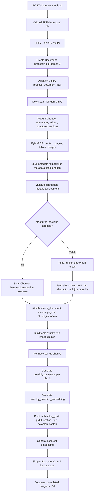
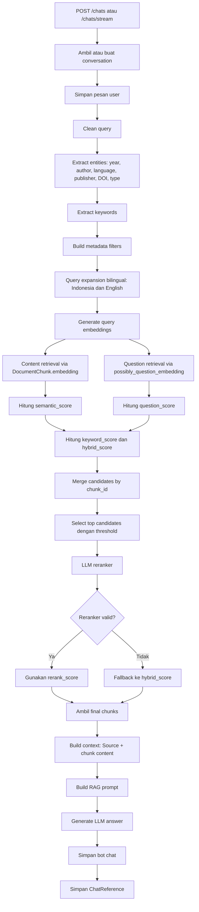
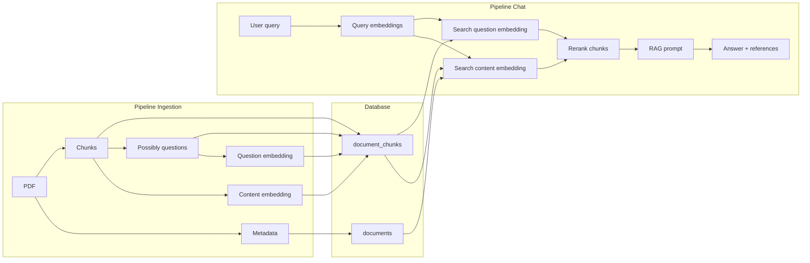

# Alur Pipeline Syntra

Dokumen ini menjelaskan dua pipeline utama di Syntra:

1. Pipeline ingestion dokumen, yaitu alur ketika user meng-upload PDF sampai dokumen berubah menjadi chunk, embedding, dan data referensi di database.
2. Pipeline chat, yaitu alur ketika user bertanya ke Syntra sampai sistem mengambil chunk relevan, membangun prompt RAG, menghasilkan jawaban, dan menyimpan referensi.

Tujuan utama Syntra adalah membuat dokumen akademik dapat dicari dan ditanya melalui chat berbasis RAG. Karena itu, pipeline ingestion bertugas mengubah PDF menjadi knowledge base, sedangkan pipeline chat bertugas mengambil knowledge base yang relevan untuk menjawab pertanyaan user.

## Gambaran Besar

```mermaid
flowchart LR
   e:\Downloads\conversation_6_ragas_20260421_175721.mdload"]
    UploadAPI --> MinIO["Simpan file ke MinIO"]
    UploadAPI --> DocRecord["Buat record Document status processing"]
    DocRecord --> Celery["Dispatch Celery process_document_task"]
    Celery --> Extract["Ekstraksi metadata, fulltext, tabel, gambar"]
    Extract --> Chunking["Smart/legacy chunking"]
    Chunking --> Questions["Generate possibly_questions"]
    Questions --> Embedding["Generate content embedding dan question embedding"]
    Embedding --> DBChunks["Simpan DocumentChunk ke database"]

    UserChat["User chat"] --> ChatAPI["POST /chats atau /chats/stream"]
    ChatAPI --> QueryProc["Clean query, entity, keyword, expansion"]
    QueryProc --> QueryEmb["Generate query embeddings"]
    QueryEmb --> Retrieval["Retrieve candidate chunks"]
    Retrieval --> Rerank["LLM reranker"]
    Rerank --> Prompt["Build RAG prompt"]
    Prompt --> LLM["Generate answer"]
    LLM --> SaveChat["Simpan chat dan references"]
```

Secara sederhana:

- Ingestion menghasilkan data siap cari: `documents`, `document_chunks`, `embedding`, `possibly_questions`, dan `possibly_question_embedding`.
- Chat memakai data tersebut untuk mencari chunk relevan, lalu mengirim konteks ke LLM agar jawaban tetap berdasarkan dokumen.

## Pipeline 1: Ingestion Dokumen

Pipeline ingestion dimulai dari endpoint upload dokumen dan dilanjutkan oleh Celery task di background.

File utama:

- `app/api/routes/documents.py`
- `app/tasks/document_tasks.py`
- `app/services/document.py`
- `app/services/grobid.py`
- `app/services/metadata_extractor.py`
- `app/services/document_assets.py`
- `app/services/question_generator.py`
- `app/services/embedding.py`
- `app/services/embedding_text.py`
- `app/models/document.py`
- `app/models/document_chunk.py`

### 1. User Upload PDF

User mengirim file ke endpoint:

```text
POST /documents/upload
```

Endpoint menerima:

- file PDF
- tipe dokumen, misalnya journal, thesis, book, report, conference
- flag `is_private`
- optional `client_id` untuk WebSocket progress

Pada tahap ini, API belum melakukan pemrosesan PDF yang berat. API hanya melakukan validasi, menyimpan file, membuat record awal, dan mengirim pekerjaan ke Celery.

### 2. Validasi File

`documents.py` memanggil:

```python
FileValidator.validate_pdf(file)
FileValidator.validate_size(file_content)
```

Validasi ini memastikan:

- file benar-benar PDF
- ukuran file masih dalam batas yang diizinkan
- file layak diproses oleh pipeline berikutnya

Jika validasi gagal, proses berhenti di endpoint upload dan user menerima error HTTP.

### 3. Simpan PDF ke MinIO

Setelah file valid, file dibaca menjadi bytes lalu disimpan ke MinIO:

```python
storage = MinIOStorage()
file_path = storage.upload_file(file_content, file.filename)
```

`file_path` hasil upload disimpan ke database pada kolom `Document.file_path`.

MinIO berfungsi sebagai object storage. Database tidak menyimpan isi PDF secara langsung, tetapi hanya path atau identifier file.

### 4. Buat Record Document Awal

Sistem membuat record `Document` dengan status awal:

```text
processing_status = "processing"
processing_progress = 0
title = "Sedang diproses..."
format = "application/pdf"
```

Pada titik ini, dokumen sudah muncul di database meskipun metadata, chunk, dan embedding belum tersedia.

Tujuannya:

- frontend bisa langsung menampilkan dokumen sedang diproses
- user tidak perlu menunggu proses PDF selesai
- progress bisa dipantau melalui polling atau WebSocket

### 5. Dispatch Celery Task

Setelah record dokumen dibuat, API menjalankan:

```python
process_document_task.delay(document.id, file_path)
```

Artinya proses berat dijalankan di background oleh worker Celery. Endpoint upload segera mengembalikan response ke user.

Jika `client_id` tersedia, backend juga mengirim pesan WebSocket bahwa proses sudah dimulai.

### 6. Celery Mengambil PDF dari MinIO

Celery task `process_document_task` mulai dengan membuka session database dan mengambil kembali file dari MinIO:

```python
file_content = storage.download_file(file_path)
```

Progress dinaikkan menjadi sekitar 10%.

### 7. Ekstraksi Metadata dan Struktur dengan GROBID

Pipeline lalu memakai GROBID untuk mengekstrak struktur akademik:

```python
header = extract_header(file_content)
references = extract_references(file_content)
fulltext = extract_fulltext(file_content)
structured_sections = extract_structured_fulltext(file_content)
metadata = format_for_database(header, references)
```

Hasil utama dari tahap ini:

- judul dokumen
- penulis atau creator
- abstrak
- DOI
- publisher/source
- references
- fulltext
- structured sections

`structured_sections` penting karena digunakan untuk smart chunking. Jika struktur berhasil diekstrak, chunk dapat mengikuti section asli dokumen seperti Introduction, Method, Result, Conclusion.

Progress dinaikkan menjadi sekitar 30%.

### 8. Ekstraksi Teks Mentah, Tabel, dan Gambar dengan PyMuPDF

Selain GROBID, pipeline juga memakai ekstraksi berbasis PDF:

```python
raw_pdf_text, pages_data = extract_raw_pdf_text(file_content)
tables_data, images_data = extract_pdf_tables_and_images(file_content)
```

Hasil tahap ini:

- `raw_pdf_text`: teks mentah dari PDF
- `pages_data`: data halaman untuk membantu mapping chunk ke halaman
- `tables_data`: tabel yang ditemukan di PDF
- `images_data`: gambar atau figure yang ditemukan di PDF

GROBID kuat untuk struktur akademik, sedangkan PyMuPDF membantu mengambil informasi visual dan teks halaman.

Progress dinaikkan menjadi sekitar 45%.

### 9. Fallback Metadata dengan LLM

Jika metadata dari GROBID dianggap tidak lengkap, Syntra menggunakan LLM sebagai fallback:

```python
if is_metadata_incomplete(metadata):
    llm_metadata = extract_metadata_with_llm(llm_input_text, metadata)
    metadata = merge_metadata(metadata, llm_metadata)
```

Fallback ini membantu jika:

- judul tidak terbaca
- author kosong
- abstrak tidak lengkap
- field Dublin Core lain tidak berhasil diekstrak

Setelah itu metadata divalidasi:

```python
metadata = validate_metadata(metadata, raw_pdf_text or fulltext or "")
```

### 10. Update Record Document

Record `Document` yang awalnya hanya berisi placeholder diperbarui dengan metadata final:

- `title`
- `creator`
- `keywords`
- `description`
- `publisher`
- `contributor`
- `date`
- `identifier`
- `source`
- `language`
- `relation`
- `coverage`
- `rights`
- `doi`
- `abstract`
- `citation_count`
- `is_metadata_complete`

Progress dinaikkan menjadi sekitar 55%.

### 11. Membuat Chunk Teks

Syntra mencoba membuat chunk dengan dua strategi.

Strategi pertama adalah smart chunking:

```python
smart_chunker.chunk_structured_sections(
    sections=structured_sections,
    document_title=metadata.get("title"),
    pages_data=pages_data,
)
```

Smart chunking dipakai jika `structured_sections` tersedia. Tujuannya agar chunk mengikuti struktur dokumen, bukan hanya potongan teks berdasarkan panjang.

Jika smart chunking gagal atau tidak menghasilkan chunk, sistem memakai legacy chunking:

```python
chunker = TextChunker()
chunks = chunker.chunk_text(metadata.get("fulltext", ""), document_title=metadata["title"])
```

Pada fallback legacy, sistem juga bisa menambahkan:

- title chunk
- abstract chunk

Chunk yang dihasilkan memiliki informasi seperti:

- `chunk_index`
- `content`
- `token_count`
- `chunk_type`
- `page_number`
- `section_title`
- `chunk_metadata`

Catatan: `token_count` pada implementasi saat ini pada banyak titik dihitung dengan `len(content.split())`, jadi secara praktis lebih dekat ke jumlah kata hasil split whitespace, bukan token tokenizer LLM yang presisi.

### 12. Menambahkan Context Metadata ke Chunk

Sebelum embedding dibuat, setiap chunk diberi konteks metadata:

```python
_attach_context_metadata_to_chunks(chunks, metadata.get("title"))
```

Context ini disimpan di `chunk_metadata`, bukan disisipkan langsung ke `content`.

Contoh metadata yang ditambahkan:

```json
{
  "source_document": "Judul Dokumen",
  "section": "Introduction",
  "sub_section": "Background",
  "page_number": 2,
  "context_in_metadata": true
}
```

Alasan konteks dimasukkan ke metadata:

- `content` tetap bersih untuk ditampilkan sebagai quote referensi
- embedding tetap bisa dibuat dari teks yang lebih kaya konteks
- audit/debug lebih mudah karena judul dan section tersimpan bersama chunk

### 13. Membuat Chunk dari Tabel dan Gambar

Pipeline juga membuat chunk tambahan dari tabel dan gambar:

```python
table_chunks = _build_table_chunks(tables_data, metadata.get("title"))
image_chunks = _build_image_chunks(images_data, metadata.get("title"))
chunks.extend(table_chunks)
chunks.extend(image_chunks)
```

Tujuannya agar informasi visual bisa ikut dicari oleh RAG.

Contoh:

- tabel performa model menjadi chunk teks
- gambar arsitektur model menjadi deskripsi teks
- grafik hasil eksperimen menjadi deskripsi teks

Chunk visual ini dapat membantu retrieval ketika user bertanya tentang gambar, tabel, grafik, atau hasil eksperimen yang tidak mudah dicari dari teks biasa.

Setelah chunk teks, tabel, dan gambar digabung, sistem melakukan re-index:

```python
for i, chunk_data in enumerate(chunks):
    chunk_data["chunk_index"] = i
```

Progress dinaikkan menjadi sekitar 65%.

### 14. Generate Possibly Questions

Setiap chunk diproses oleh question generator:

```python
questions = generate_possibly_questions(
    chunk_content=content,
    section_title=section_title,
    document_title=doc_title,
)
```

`possibly_questions` adalah daftar pertanyaan hipotetis yang mungkin bisa dijawab oleh chunk tersebut.

Contoh chunk berisi:

```text
CNN digunakan untuk ekstraksi fitur gambar kanker kulit...
```

Maka possibly questions bisa berupa:

```text
Apa kegunaan CNN dalam penelitian Pengembangan Deteksi Kanker?
Bagaimana CNN digunakan untuk ekstraksi fitur gambar kanker kulit?
```

Kegunaannya:

- meningkatkan recall retrieval
- membantu query user yang berbentuk pertanyaan
- memungkinkan chunk ditemukan walaupun kata-kata user tidak persis sama dengan isi chunk

Jika LLM gagal menghasilkan pertanyaan dan `token_count >= 30`, sistem memakai fallback questions:

```python
_build_fallback_questions(...)
```

Dengan aturan saat ini, chunk dengan `token_count >= 30` diusahakan tidak menyimpan `possibly_questions = null`.

### 15. Generate Possibly Question Embedding

Jika possibly questions berhasil dibuat, pertanyaan digabung:

```python
combined_questions = " ".join(questions)
possibly_question_embedding = generate_embedding(combined_questions)
```

Embedding ini disimpan ke:

```text
DocumentChunk.possibly_question_embedding
```

Embedding ini berbeda dari content embedding:

- content embedding dibuat dari isi chunk
- question embedding dibuat dari pertanyaan hipotetis tentang chunk

Saat chat, dua jalur ini dipakai bersamaan agar retrieval lebih kuat.

Progress bergerak dari sekitar 65% ke 75%.

### 16. Membuat Embedding Text untuk Content Embedding

Sebelum embedding content dibuat, Syntra membangun `embedding_text`:

```python
embedding_text = build_embedding_text(chunk_data)
```

Formatnya:

```text
Judul Dokumen: <source_document>
Bagian: <section_title atau chunk_metadata.section>
Subbagian: <chunk_metadata.sub_section jika ada>
Tipe Konten: <chunk_type>
Halaman: <page_number jika ada>

Konten:
<content>
```

Contoh:

```text
Judul Dokumen: Pengembangan Deteksi Kanker Menggunakan CNN
Bagian: Metodologi
Subbagian: Ekstraksi Fitur
Tipe Konten: paragraph
Halaman: 5

Konten:
CNN digunakan untuk mengekstraksi fitur visual dari citra histopatologi agar model dapat membedakan jaringan normal dan jaringan kanker.
```

Yang dikirim ke embedding model adalah `embedding_text`, bukan hanya `content`.

Manfaatnya:

- chunk pendek tetap memiliki konteks dokumen
- query yang menyebut judul dokumen lebih mudah cocok
- section seperti Method, Result, atau Conclusion ikut mempengaruhi embedding
- retrieval lebih akurat ketika banyak dokumen membahas topik mirip

`embedding_text` juga disimpan ke:

```text
chunk_metadata["embedding_text"]
```

Ini berguna untuk audit dan debugging.

### 17. Generate Content Embedding

Content embedding dibuat dengan:

```python
chunk_data["_embedding"] = generate_embedding(embedding_text)
```

Service embedding memakai Ollama:

```text
POST <OLLAMA_BASE_URL>/api/embeddings
model = OLLAMA_EMBEDDING_MODEL
output_dimensionality = OLLAMA_EMBEDDING_DIMENSION
```

Dimensi embedding mengikuti konfigurasi:

```text
OLLAMA_EMBEDDING_MODEL
OLLAMA_EMBEDDING_DIMENSION
```

Jika model menghasilkan dimensi berbeda dari config, embedding ditolak agar error lebih jelas dan tidak baru muncul saat query pgvector.

Progress bergerak dari sekitar 75% ke 90%.

### 18. Simpan Chunk ke Database

Setelah semua data siap, setiap chunk disimpan sebagai `DocumentChunk`:

```python
DocumentChunk(
    document_id=document.id,
    chunk_index=chunk_data["chunk_index"],
    content=chunk_data["content"],
    token_count=chunk_data.get("token_count", ...),
    embedding=chunk_data.get("_embedding"),
    chunk_type=chunk_data.get("chunk_type"),
    page_number=chunk_data.get("page_number"),
    section_title=chunk_data.get("section_title"),
    chunk_metadata=chunk_data.get("chunk_metadata"),
    possibly_questions=chunk_data.get("_possibly_questions"),
    possibly_question_embedding=chunk_data.get("_possibly_question_embedding"),
)
```

Data penting yang akhirnya tersedia di database:

- `documents`: metadata dokumen dan status processing
- `document_chunks.content`: teks chunk yang bersih untuk ditampilkan
- `document_chunks.embedding`: embedding dari `embedding_text`
- `document_chunks.possibly_questions`: pertanyaan hipotetis
- `document_chunks.possibly_question_embedding`: embedding dari pertanyaan hipotetis
- `document_chunks.chunk_metadata`: konteks tambahan, termasuk `embedding_text`

Progress bergerak dari sekitar 90% ke 95%.

### 19. Tandai Dokumen Selesai

Jika semua chunk berhasil disimpan:

```text
processing_status = "completed"
processing_progress = 100
processing_error = null
```

Jika terjadi error:

```text
processing_status = "failed"
processing_error = "<jenis error>: <pesan error>"
```

Celery dapat retry untuk error transient sesuai konfigurasi task.

### Diagram Pipeline Ingestion



## Pipeline 2: User Chat ke Syntra

Pipeline chat dimulai ketika user mengirim pertanyaan ke endpoint chat.

File utama:

- `app/api/routes/chats.py`
- `app/services/chat.py`
- `app/services/chat_query.py`
- `app/services/retrieval.py`
- `app/services/reranker.py`
- `app/services/rag_prompt.py`
- `app/services/embedding.py`
- `app/services/llm.py`
- `app/models/chat.py`
- `app/models/document_chunk.py`
- `app/models/document.py`

Syntra mendukung dua mode:

```text
POST /chats
POST /chats/stream
```

Perbedaannya:

- `/chats` mengembalikan jawaban setelah LLM selesai.
- `/chats/stream` mengirim potongan jawaban secara streaming.

Alur retrieval dan RAG keduanya sama.

### 1. User Mengirim Pertanyaan

Request masuk ke route:

```python
chat_service = ChatService(db)
response = await chat_service.process_chat(current_user.id, request)
```

Untuk streaming:

```python
async for event in chat_service.process_chat_stream(current_user.id, request):
    yield json.dumps(event, ensure_ascii=False) + "\n"
```

Request membawa:

- `message`
- optional `conversation_id`

### 2. Ambil atau Buat Conversation

Jika request membawa `conversation_id`, Syntra mengambil conversation lama milik user.

Jika tidak ada, Syntra membuat conversation baru:

```python
title = " ".join(request.message.split()[:5])
```

Conversation memastikan histori chat user tersimpan dan bisa dibuka kembali.

### 3. Simpan Pesan User

Pesan user disimpan ke tabel chat:

```python
self._save_chat_message(conversation.id, ChatRole.USER, request.message)
```

Setelah ini, pertanyaan sudah terekam meskipun retrieval atau LLM gagal.

### 4. Query Processing

Syntra membersihkan dan menganalisis query:

```python
query_info = self._process_query(request.message)
```

Hasilnya:

```json
{
  "original_query": "...",
  "cleaned_query": "...",
  "entities": {},
  "keywords": []
}
```

Tahap ini mencakup:

- lowercasing
- hapus tanda baca akhir
- normalisasi whitespace
- ekstraksi entity
- ekstraksi keyword

Entity yang dicari mengikuti field Dublin Core:

- tahun publikasi
- creator atau author
- bahasa
- publisher
- lokasi atau coverage
- source atau journal
- DOI
- tipe dokumen

Contoh:

```text
Jelaskan metode YOLO pada jurnal tahun 2025
```

Bisa menghasilkan:

```json
{
  "entities": {
    "year": 2025,
    "doc_type": "journal"
  },
  "keywords": ["metode", "yolo"]
}
```

### 5. Metadata Filtering

Entity yang ditemukan diubah menjadi filter SQLAlchemy:

```python
metadata_filters = self._build_metadata_filters(query_info["entities"])
```

Contoh mapping:

- year -> `Document.date`
- creator -> `Document.creator` atau `Document.contributor`
- language -> `Document.language`
- publisher -> `Document.publisher`
- source -> `Document.source`
- DOI -> `Document.doi`
- document type -> `Document.type`

Metadata filter membantu mempersempit pencarian jika user menyebut atribut dokumen.

Jika hasil filter terlalu sedikit, retrieval akan fallback ke pencarian tanpa filter agar jawaban tidak kosong terlalu cepat.

### 6. Query Expansion Bilingual

Syntra membuat variasi query dalam Bahasa Indonesia dan Bahasa Inggris:

```python
expanded_queries = await self._expand_query(query_info["cleaned_query"])
```

Prompt meminta LLM menghasilkan tepat:

```text
Bahasa Indonesia: <parafrasa>
English: <translation or equivalent search query>
```

Hasil akhir minimal berisi:

- query asli
- variasi Bahasa Indonesia
- variasi Bahasa Inggris

Tujuannya:

- dokumen akademik sering berbahasa Inggris
- user bisa bertanya dalam Bahasa Indonesia
- retrieval lebih mudah menemukan istilah akademik Inggris seperti detection, optimization, dataset, performance, architecture

Jika LLM gagal, Syntra memakai fallback bilingual agar slot Indonesia dan Inggris tetap ada.

### 7. Generate Query Embeddings

Setiap expanded query dikirim ke embedding service:

```python
emb = generate_embedding(q)
```

Hanya embedding valid yang dipakai:

```python
if emb is not None:
    query_embeddings.append(emb)
```

Jika ada 3 query valid, retrieval akan mencari kandidat dengan 3 embedding query.

Ini membuat retrieval menjadi multi-query retrieval.

### 8. Candidate Retrieval dari Dua Jalur

Syntra mencari kandidat chunk dari dua jalur:

1. Content embedding:

```text
DocumentChunk.embedding
```

2. Question embedding:

```text
DocumentChunk.possibly_question_embedding
```

Untuk setiap query embedding, sistem mengambil kandidat top-N dari dua jalur tersebut:

```python
content_rows = _fetch_similarity_candidates(..., retrieval_source="content")
question_rows = _fetch_similarity_candidates(..., retrieval_source="question")
```

Default candidate pool:

```text
candidate_limit = limit * 10
```

Jika `limit = 8`, maka setiap jalur dapat mengambil sampai 80 kandidat per query embedding.

Kenapa dua jalur?

- Content embedding cocok ketika query mirip dengan isi chunk.
- Question embedding cocok ketika query user mirip dengan pertanyaan hipotetis yang bisa dijawab chunk.

Contoh:

Isi chunk:

```text
The proposed model uses multilevel hyperparameter optimization with TPE and grid search.
```

Possibly question:

```text
Bagaimana iYOLOV7-TPE-SS mengoptimalkan hyperparameter?
```

Jika user bertanya:

```text
Bagaimana cara model ini mengatur hyperparameter?
```

Question embedding bisa lebih dekat daripada content embedding.

### 9. Similarity Score

Untuk content retrieval:

```text
semantic_score = 1 - cosine_distance(DocumentChunk.embedding, query_embedding)
```

Untuk question retrieval:

```text
question_score = 1 - cosine_distance(DocumentChunk.possibly_question_embedding, query_embedding)
```

Jika chunk tidak punya `possibly_question_embedding`, `question_score` dianggap 0.

### 10. Keyword Score

Selain similarity embedding, Syntra menghitung keyword score:

```python
keyword_score = calculate_keyword_score(chunk.content, doc, keywords)
```

Keyword dicocokkan ke:

- title
- keywords
- abstract
- description
- creator
- contributor
- publisher
- source
- relation
- language
- date
- content chunk

Bobot metadata tertentu lebih tinggi, misalnya title dan keywords.

Tujuannya agar retrieval tidak hanya bergantung pada vector similarity, tetapi juga mempertimbangkan kecocokan literal terhadap metadata penting.

### 11. Hybrid Score

Syntra menggabungkan score:

```python
combined_semantic = max(semantic_score, question_score)
```

Jika metadata filter aktif:

```text
hybrid_score = combined_semantic * 0.80 + keyword_score * 0.20
hybrid_score *= 1.1
```

Jika metadata filter tidak aktif:

```text
hybrid_score = combined_semantic * 0.65 + keyword_score * 0.35
```

Artinya:

- embedding tetap menjadi sinyal utama
- keyword tetap membantu jika query berisi istilah spesifik
- metadata filter memberi boost karena dokumen sudah lebih spesifik

### 12. Merge Candidate

Kandidat dari content embedding dan question embedding digabung berdasarkan `chunk_id`:

```python
best_scores = merge_candidate_scores(best_scores, candidate_rows)
```

Jika chunk yang sama muncul dari dua jalur, Syntra menyimpan versi dengan `hybrid_score` terbaik.

Ini penting karena chunk relevan tidak boleh hilang hanya karena salah satu jalur embedding skornya lebih rendah.

### 13. Select Ranked Candidates

Setelah semua kandidat digabung, Syntra memilih kandidat awal:

```python
selected_candidates = self._select_ranked_candidates(
    candidates,
    limit=limit * 4,
    threshold=threshold,
)
```

Default:

```text
limit = 8
threshold = 0.35
```

Sebelum reranker, sistem bisa memilih sampai:

```text
limit * 4 = 32 kandidat
```

Aturan seleksi:

- urutkan berdasarkan `hybrid_score`
- buang kandidat di bawah threshold
- batasi jumlah chunk per dokumen
- ambil kandidat terbaik untuk dikirim ke reranker

### 14. LLM Reranker

Kandidat awal dikirim ke reranker:

```python
reranked_candidates = await rerank_chunks(query, selected_candidates, limit=limit)
```

Reranker menerima:

- query user
- chunk_id
- document_title
- section_title
- page_number
- content
- skor awal retrieval

Reranker diminta menghasilkan JSON array:

```json
[
  {
    "chunk_id": 1,
    "score": 0.95,
    "reason": "Alasan singkat"
  }
]
```

Reranker hanya boleh memilih chunk dari candidate pool. Ia tidak mencari seluruh database.

Jika LLM reranker gagal, JSON invalid, atau chunk id tidak cocok, Syntra fallback ke ranking hybrid lama.

Jika hasil reranker kurang dari `limit`, sistem melengkapi sisanya dari fallback hybrid ranking.

Skor akhir yang dipakai:

- `rerank_score` jika reranker berhasil
- `hybrid_score` jika fallback

### 15. Ambil Chunk Final dan Similarity

Hasil reranker dikonversi menjadi:

```python
chunks, similarities = candidate_dicts_to_chunks(reranked_candidates)
```

`chunks` adalah daftar `DocumentChunk` final yang akan masuk ke prompt.

`similarities` adalah score final yang nanti disimpan sebagai `ChatReference.relevance_score`.

### 16. Build Context Text

Syntra membangun konteks RAG dari chunk final:

```python
context_text = self._construct_context_text(chunks)
```

Format setiap chunk:

```text
[Source: <document_title>]
<chunk.content>
```

Antar chunk dipisahkan dengan:

```text
---
```

Contoh:

```text
[Source: iYOLOV7-TPE-SS]
The proposed system uses improved YOLOv7 with multilevel hyperparameter optimization...

---

[Source: iYOLOV7-TPE-SS]
The model is evaluated on Jetson Nano edge devices...
```

### 17. Build RAG Prompt

Prompt akhir dibangun dengan:

```python
full_prompt = self._construct_rag_prompt(request.message, context_text)
```

Jika konteks ditemukan, prompt memberi instruksi:

- jawab berdasarkan konteks dokumen
- gunakan informasi dari konteks
- sebutkan sumber dokumen
- gunakan bahasa yang sama dengan pertanyaan user
- jika konteks tidak membahas topik, katakan informasi tidak ditemukan

Jika tidak ada konteks, prompt meminta LLM menjawab bahwa informasi relevan tidak ditemukan di dokumen.

### 18. Generate Jawaban LLM

Untuk non-streaming:

```python
answer = await generate_response(full_prompt)
```

Untuk streaming:

```python
async for chunk in generate_response_stream(full_prompt):
    yield {"type": "chunk", "content": chunk}
```

Pada streaming, potongan jawaban dikumpulkan kembali menjadi `answer` final agar bisa disimpan ke database.

### 19. Print Data RAGAS

Syntra juga mencetak data evaluasi RAGAS:

```json
{
  "query": ["pertanyaan user"],
  "generated_response": ["jawaban LLM"],
  "retrieved_documents": [["chunk 1", "chunk 2"]]
}
```

Ini berguna untuk debugging dan evaluasi kualitas RAG, meskipun pada implementasi sekarang data tersebut hanya dicetak ke log.

### 20. Simpan Jawaban Bot

Jawaban bot disimpan sebagai chat message:

```python
bot_chat = self._save_chat_message(conversation.id, ChatRole.BOT, answer)
```

Dengan ini conversation berisi pasangan:

- user message
- bot answer

### 21. Simpan Referensi RAG

Setiap chunk final disimpan sebagai referensi jawaban:

```python
ChatReference(
    chat_id=bot_chat.id,
    document_id=chunk.document_id,
    chunk_id=chunk.id,
    relevance_score=float(similarities[i]),
    quote=chunk.content[:200],
    page_number=chunk.page_number,
)
```

Referensi ini berguna untuk:

- menampilkan sumber jawaban di frontend
- melihat chunk mana yang dipakai
- audit jawaban LLM
- debugging retrieval

Pada streaming, references juga dikirim di event `done`.

### Diagram Pipeline Chat



## Hubungan Antara Dua Pipeline

Pipeline ingestion dan pipeline chat saling terhubung melalui tabel `documents` dan `document_chunks`.



Jika ingestion buruk, chat juga akan buruk. Contohnya:

- chunk terlalu besar -> retrieval kurang presisi
- chunk terlalu kecil -> konteks jawaban tidak lengkap
- embedding salah dimensi -> query pgvector error
- possibly questions null -> question retrieval melemah
- metadata title/author salah -> metadata filtering dan source display terganggu
- section/page kosong -> referensi kurang informatif

Sebaliknya, jika ingestion kuat, chat lebih mudah menemukan jawaban yang benar.

## Data yang Mengalir di Setiap Tahap

### Ingestion

| Tahap | Input | Output |
| --- | --- | --- |
| Upload | PDF dari user | File tersimpan di MinIO |
| Create document | file_path | Record `Document` status processing |
| GROBID extraction | PDF bytes | header, references, fulltext, structured sections |
| PyMuPDF extraction | PDF bytes | raw text, pages, tables, images |
| Metadata validation | metadata + raw text | metadata final |
| Chunking | structured sections/fulltext | daftar chunk teks |
| Asset chunking | tables/images | chunk tabel dan gambar |
| Question generation | chunk content | possibly_questions |
| Question embedding | possibly_questions | possibly_question_embedding |
| Embedding text | chunk + metadata | embedding_text |
| Content embedding | embedding_text | embedding vector |
| Persist | chunks lengkap | rows `DocumentChunk` |

### Chat

| Tahap | Input | Output |
| --- | --- | --- |
| Conversation | user_id + request | conversation |
| Save user message | message | row chat user |
| Query processing | message | cleaned_query, entities, keywords |
| Metadata filtering | entities | SQLAlchemy filters |
| Query expansion | cleaned_query | query asli + Indonesia + English |
| Query embedding | expanded queries | query embedding list |
| Candidate retrieval | query embeddings | content candidates + question candidates |
| Hybrid scoring | candidates + keywords | hybrid_score |
| Merge | candidates multi-jalur | unique candidates by chunk_id |
| Rerank | query + candidates | final top chunks |
| Context formatting | chunks | context_text |
| Prompting | message + context | full_prompt |
| LLM response | full_prompt | answer |
| Save answer | answer | row chat bot |
| Save references | chunks + scores | rows `ChatReference` |

## Contoh End-to-End

Misalnya user upload paper:

```text
iYOLOV7-TPE-SS: Leveraging Improved YOLO Model With Multilevel Hyperparameter Optimization for Road Damage Detection on Edge Devices
```

### Saat Ingestion

1. PDF disimpan ke MinIO.
2. Record `Document` dibuat dengan title sementara `Sedang diproses...`.
3. Celery mengambil PDF.
4. GROBID mengambil title, author, abstract, references, dan section.
5. PyMuPDF mengambil teks halaman, tabel, dan gambar.
6. SmartChunker membuat chunk berdasarkan section seperti Introduction, Proposed System, Performance Measurement.
7. Setiap chunk diberi metadata:

```json
{
  "source_document": "iYOLOV7-TPE-SS: Leveraging Improved YOLO Model With Multilevel Hyperparameter Optimization for Road Damage Detection on Edge Devices",
  "section": "Proposed System",
  "page_number": 5
}
```

8. Question generator membuat pertanyaan:

```text
Bagaimana iYOLOV7-TPE-SS melakukan optimasi hyperparameter?
What hyperparameter optimization strategy is used in iYOLOV7-TPE-SS?
```

9. Content embedding dibuat dari:

```text
Judul Dokumen: iYOLOV7-TPE-SS: Leveraging Improved YOLO Model With Multilevel Hyperparameter Optimization for Road Damage Detection on Edge Devices
Bagian: Proposed System
Tipe Konten: paragraph
Halaman: 5

Konten:
The proposed system uses multilevel hyperparameter optimization...
```

10. Chunk, embedding, possibly questions, dan question embedding disimpan ke database.

### Saat Chat

User bertanya:

```text
Bagaimana model iYOLOV7-TPE-SS mengoptimalkan hyperparameter?
```

Syntra melakukan:

1. Membersihkan query.
2. Membuat variasi Bahasa Indonesia dan English.
3. Membuat embedding untuk semua variasi query.
4. Mencari chunk lewat content embedding dan question embedding.
5. Menggabungkan kandidat berdasarkan chunk id.
6. Menghitung hybrid score.
7. Mengirim kandidat terbaik ke LLM reranker.
8. Mengambil chunk final.
9. Membuat konteks:

```text
[Source: iYOLOV7-TPE-SS]
The proposed system uses multilevel hyperparameter optimization...
```

10. Membuat prompt RAG.
11. LLM menjawab berdasarkan konteks.
12. Syntra menyimpan jawaban dan referensi chunk.

## Titik Penting untuk Debugging

### Jika Upload Berhasil tetapi Chat Tidak Menemukan Jawaban

Cek:

- Apakah `processing_status = completed`?
- Apakah jumlah chunk lebih dari 0?
- Apakah `DocumentChunk.embedding` tidak null?
- Apakah `possibly_questions` ada untuk chunk dengan konten cukup panjang?
- Apakah `possibly_question_embedding` tidak null?
- Apakah `chunk_metadata.embedding_text` terisi?
- Apakah dimensi vector database sama dengan `OLLAMA_EMBEDDING_DIMENSION`?

### Jika Retrieval Lemah

Cek:

- Apakah chunk terlalu besar atau terlalu kecil?
- Apakah judul dokumen masuk ke `embedding_text`?
- Apakah section title masuk ke `embedding_text`?
- Apakah query expansion menghasilkan Bahasa Indonesia dan English?
- Apakah candidate dari question embedding ikut masuk?
- Apakah reranker fallback karena JSON invalid?
- Apakah threshold 0.35 terlalu tinggi untuk kasus tertentu?

### Jika Referensi Jawaban Tidak Akurat

Cek:

- `ChatReference.chunk_id`
- `ChatReference.relevance_score`
- `DocumentChunk.content`
- `DocumentChunk.page_number`
- `DocumentChunk.section_title`
- `chunk_metadata["embedding_text"]`

Referensi yang baik seharusnya berasal dari chunk yang memang menjawab pertanyaan, bukan hanya chunk yang memiliki keyword mirip.

## Ringkasan Akhir

Pipeline ingestion bertugas mengubah PDF menjadi knowledge base:

```text
PDF -> metadata -> chunks -> questions -> embeddings -> database
```

Pipeline chat bertugas menggunakan knowledge base untuk menjawab pertanyaan:

```text
User question -> query expansion -> embeddings -> retrieval -> rerank -> RAG prompt -> LLM answer -> references
```

Dua pipeline ini harus sama-sama sehat. Ingestion menentukan kualitas data yang tersedia, sedangkan chat menentukan seberapa baik data itu ditemukan dan dipakai untuk menjawab user.
