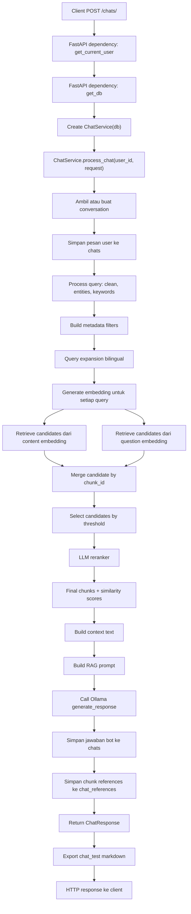
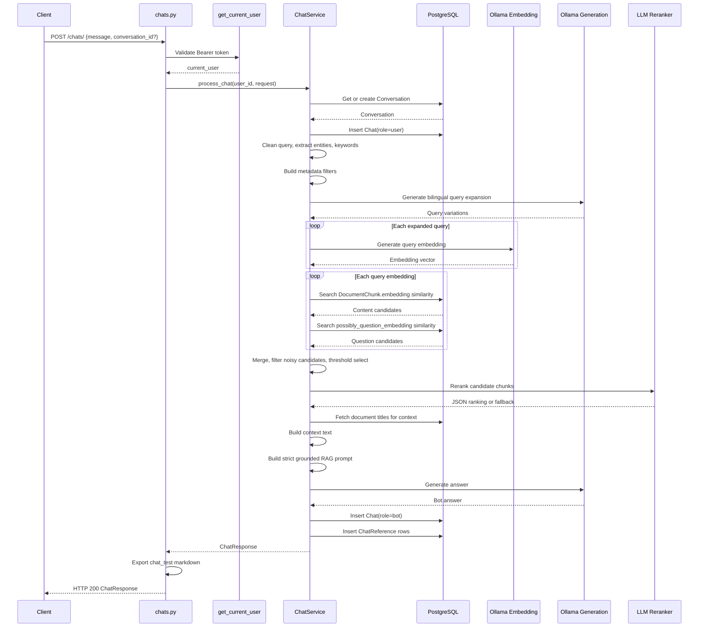
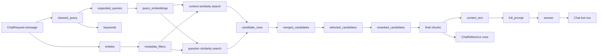

# Pipeline POST Chat SyntraFix

Dokumen ini menjelaskan alur lengkap ketika user mengirim pesan ke chatbot melalui API:

```text
POST /chats/
```

Endpoint ini berada di:

```text
FastAPI/app/api/routes/chats.py
```

Pipeline utamanya berjalan di:

```text
FastAPI/app/services/chat.py
```

Secara ringkas, API ini menerima pertanyaan user, menyimpan pesan user, melakukan retrieval dokumen berbasis RAG, membuat prompt berdasarkan konteks dokumen, memanggil LLM, menyimpan jawaban bot, lalu menyimpan referensi chunk dokumen yang dipakai untuk jawaban.

---

## 1. Gambaran Singkat

Alur besar `POST /chats/`:

```text
User question
-> FastAPI route /chats/
-> validasi user dari JWT
-> buat/ambil conversation
-> simpan pesan user
-> proses query
-> metadata filtering
-> query expansion
-> generate query embedding
-> retrieve document chunks
-> rerank chunks
-> build context
-> build RAG prompt
-> call LLM
-> simpan jawaban bot
-> simpan chat references
-> return ChatResponse
```

Pipeline ini adalah pipeline RAG synchronous. Artinya endpoint menunggu seluruh proses selesai sebelum mengembalikan response. Untuk UI realtime, codebase juga menyediakan:

```text
POST /chats/stream
```

Namun dokumen ini fokus pada `POST /chats/`, lalu menjelaskan perbedaannya dengan streaming di bagian akhir.

---

## 2. File yang Terlibat

File utama:

```text
FastAPI/app/api/routes/chats.py
FastAPI/app/services/chat.py
FastAPI/app/services/chat_query.py
FastAPI/app/services/embedding.py
FastAPI/app/services/retrieval.py
FastAPI/app/services/reranker.py
FastAPI/app/services/rag_prompt.py
FastAPI/app/services/llm.py
FastAPI/app/models/chat.py
FastAPI/app/models/document.py
FastAPI/app/models/document_chunk.py
FastAPI/app/schemas/chat.py
```

Peran tiap file:

| File | Peran |
| --- | --- |
| `chats.py` | Route FastAPI untuk menerima request chat |
| `chat.py` service | Orkestrasi utama pipeline chat RAG |
| `chat_query.py` | Membersihkan query, ekstraksi entity, ekstraksi keyword |
| `embedding.py` | Membuat vector embedding query memakai Ollama |
| `retrieval.py` | Helper merge candidate dan konversi candidate ke chunk |
| `reranker.py` | Reranking kandidat chunk memakai LLM |
| `rag_prompt.py` | Membentuk context text dan prompt RAG |
| `llm.py` | Memanggil model generation Ollama |
| `models/chat.py` | Model `Conversation`, `Chat`, `ChatReference` |
| `schemas/chat.py` | Schema request dan response chat |

---

## 3. Request dan Response

## 3.1 Request Body

Schema request ada di `FastAPI/app/schemas/chat.py`:

```python
class ChatRequest(BaseModel):
    message: str
    conversation_id: Optional[int] = None
```

Contoh request:

```json
{
  "message": "Apa manfaat CNN dalam software engineering?",
  "conversation_id": 10
}
```

Jika `conversation_id` dikirim, pesan masuk ke conversation lama. Jika tidak dikirim, sistem membuat conversation baru.

## 3.2 Response Body

Schema response:

```python
class ChatResponse(BaseModel):
    id: int
    conversation_id: int
    role: Literal["user", "bot"]
    message: str
    created_at: datetime
    references: List[ChatReferenceResponse] = []
```

Untuk `POST /chats/`, implementasi saat ini mengembalikan response bot dengan:

```python
references=[]
```

Walaupun `references` dikembalikan kosong pada response endpoint non-streaming, referensi tetap disimpan ke tabel `chat_references` setelah jawaban bot dibuat.

---

## 4. Entry Point Route `POST /chats/`

Route berada di:

```python
@router.post("/", response_model=ChatResponse)
async def chat_interaction(
    request: ChatRequest,
    current_user: User = Depends(get_current_user),
    db: Session = Depends(get_db)
):
```

Ada dua dependency penting:

```python
current_user: User = Depends(get_current_user)
db: Session = Depends(get_db)
```

Artinya:

- endpoint hanya bisa dipakai oleh user yang sudah login
- user harus mengirim `Authorization: Bearer <access_token>`
- session database dibuat untuk request ini

Flow di route:

```python
chat_service = ChatService(db)
response = await chat_service.process_chat(current_user.id, request)
export_chat_test_markdown_for_bot_chat(db, response.id)
return response
```

Jadi `chats.py` tidak menjalankan RAG secara langsung. Ia hanya:

- membuat instance `ChatService`
- memanggil `process_chat()`
- mencoba export markdown untuk data uji chat
- mengembalikan response

Jika export markdown gagal, error hanya dicetak sebagai warning dan response chat tetap dikembalikan.

---

## 5. Flow Diagram Utama



---

## 6. Tahap 1: Autentikasi User

Sebelum masuk ke logic chat, FastAPI menjalankan:

```python
current_user: User = Depends(get_current_user)
```

Dependency ini membaca bearer token, melakukan decode JWT, memastikan token bertipe `access`, lalu mengambil user dari database.

Jika token tidak valid:

```text
401 Unauthorized
```

Jika user tidak aktif:

```text
403 Forbidden
```

Tujuan tahap ini adalah memastikan setiap chat selalu punya `user_id` yang valid. `user_id` nanti dipakai untuk memastikan conversation hanya bisa diakses oleh pemiliknya.

---

## 7. Tahap 2: Membuat `ChatService`

Route membuat:

```python
chat_service = ChatService(db)
```

`ChatService` menyimpan database session:

```python
class ChatService:
    def __init__(self, db: Session):
        self.db = db
```

Semua operasi database selama pipeline chat memakai session ini:

- mengambil conversation
- membuat conversation
- menyimpan pesan user
- mengambil chunk dokumen
- menyimpan jawaban bot
- menyimpan references

---

## 8. Tahap 3: Ambil atau Buat Conversation

Fungsi:

```python
conversation = self._handle_conversation(user_id, request)
```

Jika `request.conversation_id` ada:

```python
conversation = self.get_conversation(request.conversation_id, user_id)
```

Query ini memastikan conversation cocok dengan:

```text
Conversation.id == conversation_id
Conversation.user_id == user_id
```

Jika conversation tidak ditemukan:

```text
404 Conversation not found
```

Jika `conversation_id` tidak dikirim, sistem membuat conversation baru:

```python
title = " ".join(request.message.split()[:5])
return self.create_conversation(user_id, title)
```

Title conversation otomatis dibuat dari 5 kata pertama pesan user.

Data yang masuk ke tabel `conversations`:

```text
user_id
title
is_pinned default false
created_at
updated_at
```

---

## 9. Tahap 4: Simpan Pesan User

Setelah conversation siap, pesan user disimpan:

```python
self._save_chat_message(conversation.id, ChatRole.USER, request.message)
```

Fungsi ini membuat row baru di tabel `chats`:

```python
Chat(
    conversation_id=conversation_id,
    role=ChatRole.USER,
    message=message
)
```

Tujuannya:

- histori chat tersimpan sejak awal
- pertanyaan user tetap tercatat walaupun proses RAG setelahnya gagal
- conversation bisa ditampilkan ulang oleh endpoint history

---

## 10. Tahap 5: Query Processing

Fungsi:

```python
query_info = self._process_query(request.message)
```

Implementasi sebenarnya memanggil:

```python
chat_query.process_query(query)
```

Output-nya:

```python
{
    "original_query": query,
    "cleaned_query": cleaned,
    "entities": entities,
    "keywords": keywords,
}
```

## 10.1 Clean Query

Query dibersihkan dengan:

```python
cleaned = query.lower().strip()
cleaned = re.sub(r'[?!.,;:]+$', '', cleaned)
cleaned = re.sub(r'\s+', ' ', cleaned)
```

Contoh:

```text
"Jelaskan CNN dalam Software Engineering!!!"
```

menjadi:

```text
"jelaskan cnn dalam software engineering"
```

## 10.2 Extract Entities

Sistem mencoba mendeteksi entity dari query user. Entity ini dipetakan ke metadata Dublin Core di tabel `documents`.

Entity yang didukung:

| Entity | Contoh query | Target database |
| --- | --- | --- |
| `year` | `tahun 2024` | `Document.date` |
| `creator` | `oleh Smith` | `Document.creator` atau `Document.contributor` |
| `language` | `bahasa inggris` | `Document.language` |
| `publisher` | `diterbitkan IEEE` | `Document.publisher` |
| `location` | `di Indonesia` | `Document.coverage` |
| `source` | `jurnal Software Engineering` | `Document.source` |
| `doi` | `10.xxxx/...` | `Document.doi` |
| `doc_type` | `jurnal`, `thesis`, `conference` | `Document.type` |

Contoh:

```text
"Jelaskan CNN pada jurnal tahun 2024"
```

bisa menghasilkan:

```python
{
    "year": 2024,
    "doc_type": DocumentType.JOURNAL
}
```

## 10.3 Extract Keywords

Setelah query dibersihkan, sistem mengambil kata penting dengan membuang stopword seperti:

```text
di, dan, yang, untuk, dengan, dari, apa, bagaimana, jelaskan, tahun, jurnal
```

Keyword ini disiapkan untuk scoring literal terhadap metadata dan content. Pada implementasi `chat.py` saat ini, candidate score yang aktif memakai semantic/question score sebagai `hybrid_score`, sedangkan `keyword_score` diset `0.0` di `_build_candidate_score()`.

---

## 11. Tahap 6: Metadata Filtering

Fungsi:

```python
metadata_filters = self._build_metadata_filters(query_info["entities"])
```

Entity query diubah menjadi filter SQLAlchemy.

Contoh mapping:

```python
year -> extract('year', Document.date) == year
creator -> Document.creator.ilike(...) OR Document.contributor.ilike(...)
language -> Document.language.ilike(...)
publisher -> Document.publisher.ilike(...)
location -> Document.coverage.ilike(...)
source -> Document.source.ilike(...)
doi -> Document.doi == doi
doc_type -> Document.type == doc_type
```

Jika user menyebut tahun, penulis, DOI, tipe dokumen, atau jurnal tertentu, retrieval akan mencoba mencari chunk dari dokumen yang metadata-nya cocok.

Namun ada fallback penting. Jika filter metadata menghasilkan terlalu sedikit kandidat, sistem kembali ke pencarian tanpa filter:

```python
if len(rows) >= 2:
    return rows
print("Too few metadata-filtered results, fallback to unfiltered")
```

Ini mencegah chatbot gagal total hanya karena entity extraction terlalu ketat atau metadata dokumen tidak lengkap.

---

## 12. Tahap 7: Query Expansion Bilingual

Fungsi:

```python
expanded_queries = await self._expand_query(query_info["cleaned_query"])
```

Sistem meminta LLM membuat dua variasi:

```text
Bahasa Indonesia: <parafrasa pertanyaan>
English: <translation or equivalent search query>
```

Prompt yang digunakan:

```text
Buat 2 variasi berbeda dari pertanyaan berikut untuk meningkatkan pencarian dokumen akademik.
WAJIB menghasilkan tepat dua baris:
Bahasa Indonesia: <parafrasa pertanyaan dalam Bahasa Indonesia>
English: <translation or equivalent search query in English>
...
```

Hasil akhirnya minimal berisi:

- query asli
- query versi/parafrasa Indonesia
- query versi English

Alasan tahap ini penting:

- user sering bertanya dalam Bahasa Indonesia
- dokumen akademik sering berbahasa Inggris
- istilah teknis seperti `software testing`, `defect prediction`, `deep learning`, `maintenance`, atau `quality assurance` bisa muncul dalam bahasa berbeda

Jika query expansion gagal, sistem memakai fallback:

```python
return [query] + self._build_bilingual_query_fallback(query)
```

Fallback-nya:

```python
[query, f"English query: {query}"]
```

---

## 13. Tahap 8: Generate Query Embedding

Setiap query hasil expansion dibuat embedding:

```python
query_embeddings = []
for q in expanded_queries:
    emb = generate_embedding(q)
    if emb is not None:
        query_embeddings.append(emb)
```

Embedding dibuat oleh:

```text
FastAPI/app/services/embedding.py
```

Service ini memanggil Ollama:

```text
POST <OLLAMA_BASE_URL>/api/embeddings
```

Payload:

```json
{
  "model": "OLLAMA_EMBEDDING_MODEL",
  "prompt": "text query",
  "output_dimensionality": "OLLAMA_EMBEDDING_DIMENSION"
}
```

Embedding hanya dipakai jika:

- response berhasil
- field `embedding` tersedia
- panjang embedding sama dengan `OLLAMA_EMBEDDING_DIMENSION`

Jika semua embedding gagal, retrieval masih mencoba membuat embedding dari query utama di `_retrieve_relevant_chunk_candidates()`.

---

## 14. Tahap 9: Retrieve dan Rerank Chunks

Fungsi utama:

```python
chunks, similarities = await self._retrieve_and_rerank_chunks(
    query=query_info["cleaned_query"],
    metadata_filters=metadata_filters,
    query_embeddings=query_embeddings,
)
```

Default parameter:

```python
limit = 8
threshold = 0.35
```

Artinya target akhirnya adalah maksimal 8 chunk paling relevan.

---

## 15. Tahap 9A: Build Candidate Pool

Fungsi:

```python
candidates = self._retrieve_relevant_chunk_candidates(...)
```

Parameter penting:

```python
MIN_CONTENT_LENGTH = 100
candidate_limit = limit * 10
```

Jika `limit=8`, maka `candidate_limit=80`.

Sistem mencari kandidat untuk setiap query embedding. Karena query expansion bisa menghasilkan beberapa embedding, retrieval bersifat multi-query.

Untuk setiap embedding, sistem mengambil kandidat dari dua jalur:

```python
content_rows = self._fetch_similarity_candidates(..., retrieval_source="content")
question_rows = self._fetch_similarity_candidates(..., retrieval_source="question")
```

---

## 16. Tahap 9B: Retrieval Jalur Content Embedding

Jalur content memakai kolom:

```text
document_chunks.embedding
```

Similarity dihitung dengan:

```python
content_sim = 1 - DocumentChunk.embedding.cosine_distance(query_embedding)
```

Query hanya mengambil chunk yang:

- punya document title valid
- content tidak null
- content tidak kosong
- panjang content minimal 100 karakter
- embedding tidak null

Untuk jalur content:

```python
base_query = base_query.filter(DocumentChunk.embedding.isnot(None))
order_expr = content_sim
```

Hasil diurutkan berdasarkan content similarity tertinggi.

---

## 17. Tahap 9C: Retrieval Jalur Question Embedding

Jalur question memakai kolom:

```text
document_chunks.possibly_question_embedding
```

Similarity dihitung dengan:

```python
question_sim = 1 - DocumentChunk.possibly_question_embedding.cosine_distance(query_embedding)
```

Untuk jalur question:

```python
base_query = base_query.filter(DocumentChunk.possibly_question_embedding.isnot(None))
order_expr = question_sim
```

Jalur ini mencari chunk berdasarkan pertanyaan hipotetis yang pernah dibuat saat ingestion dokumen.

Contoh:

Isi chunk:

```text
The model uses CNN to extract features from images.
```

Possibly question:

```text
Bagaimana CNN digunakan untuk ekstraksi fitur gambar?
```

Jika user bertanya mirip pertanyaan itu, jalur question embedding bisa menemukan chunk dengan lebih baik daripada content embedding biasa.

---

## 18. Tahap 9D: Candidate Scoring

Setiap row diubah menjadi candidate dict:

```python
{
    "chunk": chunk,
    "chunk_id": chunk.id,
    "document_id": doc.id,
    "document_title": doc.title,
    "section_title": chunk.section_title,
    "page_number": chunk.page_number,
    "chunk_type": ...,
    "content": chunk.content,
    "semantic_score": sem_score,
    "question_score": q_score,
    "combined_semantic": max(sem_score, q_score),
    "keyword_score": 0.0,
    "hybrid_score": combined_semantic,
    "retrieval_source": retrieval_source,
}
```

Pada implementasi aktif di `chat.py`, `hybrid_score` sama dengan:

```python
max(semantic_score, question_score)
```

Jadi nama `hybrid_score` di sini berarti gabungan terbaik antara content similarity dan question similarity.

---

## 19. Tahap 9E: Filter Chunk Visual yang Noisy

Sistem membuang kandidat bertipe `image` atau `table` jika content-nya mengandung frasa seperti:

```text
maaf, saya tidak dapat
tidak dapat menginterpretasikan
gambar tidak tersedia
table tidak tersedia
unable to interpret
cannot see
image is not available
```

Tujuannya agar chunk hasil interpretasi gambar/tabel yang tidak berguna tidak masuk ke prompt RAG.

---

## 20. Tahap 9F: Merge Candidate by `chunk_id`

Candidate dari jalur content dan question digabung:

```python
best_scores = self._merge_candidate_scores(best_scores, candidate_rows)
```

Helper:

```python
retrieval.merge_candidate_scores(existing, rows)
```

Jika chunk yang sama muncul berkali-kali dari beberapa query embedding atau dari dua jalur retrieval, sistem menyimpan versi dengan `hybrid_score` tertinggi.

Ini membuat candidate pool bersih dari duplikasi chunk.

---

## 21. Tahap 9G: Select Candidate Awal

Setelah semua candidate digabung, sistem memilih kandidat awal:

```python
selected_candidates = self._select_ranked_candidates(
    candidates,
    limit=limit * 4,
    threshold=threshold,
)
```

Dengan default:

```text
limit * 4 = 32
threshold = 0.35
```

Aturan seleksi:

- urutkan berdasarkan `hybrid_score`
- stop jika skor di bawah `0.35`
- maksimal 10 chunk per document
- ambil maksimal 32 kandidat untuk reranker

Tahap ini adalah penyaringan sebelum LLM reranker.

---

## 22. Tahap 9H: LLM Reranker

Fungsi:

```python
reranked_candidates = await rerank_chunks(query, selected_candidates, limit=limit)
```

Reranker membuat prompt yang berisi:

- pertanyaan user
- daftar kandidat
- `chunk_id`
- judul dokumen
- section
- halaman
- tipe chunk
- skor awal
- potongan content kandidat

Reranker diminta menjawab hanya JSON array:

```json
[
  {"chunk_id": 1, "score": 0.95, "reason": "Alasan singkat"},
  {"chunk_id": 2, "score": 0.70, "reason": "Alasan singkat"}
]
```

Reranker memprioritaskan kandidat yang langsung menjawab pertanyaan, bukan sekadar mengandung keyword mirip.

Jika reranker gagal:

- LLM error
- JSON tidak valid
- chunk_id tidak cocok
- hasil kosong

maka sistem fallback ke ranking berdasarkan `hybrid_score`.

Jika reranker berhasil tetapi jumlah hasil kurang dari `limit`, sistem melengkapi sisanya dari fallback ranking.

Output akhir:

```python
chunks, similarities = self._candidate_dicts_to_chunks(reranked_candidates)
```

`similarities` berisi:

- `final_score` dari reranker jika ada
- atau `hybrid_score` jika fallback

---

## 23. Tahap 10: Build Context Text

Fungsi:

```python
context_text = self._construct_context_text(chunks)
```

Implementasi:

```python
rag_prompt.construct_context_text(self.db, chunks)
```

Untuk setiap chunk, sistem mengambil judul dokumen, lalu membentuk format:

```text
[Source: <judul dokumen>]
<chunk.content>
```

Antar chunk dipisah:

```text
---
```

Contoh:

```text
[Source: Software Engineering and CNN]
CNN is used to extract visual features from image data...

---

[Source: Software Engineering and CNN]
The approach improves defect prediction accuracy...
```

Context inilah yang nanti diberikan ke LLM sebagai dasar jawaban.

---

## 24. Tahap 11: Build RAG Prompt

Fungsi:

```python
full_prompt = self._construct_rag_prompt(request.message, context_text)
```

Implementasi aktif berada di:

```text
FastAPI/app/services/rag_prompt.py
```

Prompt aktif adalah variasi `Strict Grounded Answer`.

Aturan pentingnya:

- jawab hanya berdasarkan konteks
- jangan memakai pengetahuan umum
- jangan menambah asumsi
- jika konteks tidak cukup, jawab bahwa informasi tidak ditemukan
- gunakan bahasa yang sama dengan pertanyaan user
- setiap klaim penting harus didukung konteks

Jika `context_text` kosong, prompt khusus dibuat agar LLM menjawab:

```text
Maaf, saya tidak menemukan informasi yang relevan dengan pertanyaan Anda dalam dokumen yang tersedia.
```

---

## 25. Tahap 12: Generate Jawaban dengan LLM

Fungsi:

```python
answer = await generate_response(full_prompt)
```

Implementasi:

```text
FastAPI/app/services/llm.py
```

Backend memanggil Ollama:

```text
POST <OLLAMA_BASE_URL>/api/generate
```

Payload:

```json
{
  "model": "OLLAMA_GENERATION_MODEL",
  "prompt": "full_prompt",
  "stream": false
}
```

Response yang dipakai:

```python
data.get("response", "")
```

Jika terjadi timeout atau error HTTP, service mengembalikan pesan fallback, bukan melempar error ke route.

---

## 26. Tahap 13: Print Data RAGAS

Setelah jawaban dibuat, sistem mencetak data evaluasi:

```python
ragas_data = {
    "query": [request.message],
    "generated_response": [answer],
    "retrieved_documents": [retrieved_docs]
}
```

Data ini hanya dicetak ke log pada `POST /chats/`. Ia tidak disimpan langsung oleh endpoint ini.

Tujuannya untuk membantu debugging dan evaluasi kualitas RAG.

---

## 27. Tahap 14: Simpan Jawaban Bot

Jawaban bot disimpan ke tabel `chats`:

```python
bot_chat = self._save_chat_message(conversation.id, ChatRole.BOT, answer)
```

Row yang dibuat:

```text
conversation_id = conversation.id
role = bot
message = answer
```

Setelah tahap ini, conversation memiliki minimal dua message baru:

- pesan user
- jawaban bot

---

## 28. Tahap 15: Simpan RAG References

Fungsi:

```python
self._save_rag_references(bot_chat.id, chunks, similarities)
```

Untuk setiap chunk final, sistem membuat row `ChatReference`:

```python
ChatReference(
    chat_id=bot_chat.id,
    document_id=chunk.document_id,
    chunk_id=chunk.id,
    relevance_score=float(similarities[i]),
    quote=chunk.content[:200],
    page_number=chunk.page_number
)
```

Data disimpan ke tabel:

```text
chat_references
```

Tujuannya:

- melacak chunk mana yang dipakai untuk menjawab
- menyediakan sumber jawaban
- membantu audit kualitas retrieval
- memungkinkan frontend menampilkan referensi dokumen

Catatan penting:

- `quote` hanya 200 karakter pertama dari chunk
- `relevance_score` berasal dari reranker score atau fallback hybrid score
- `document_title` tidak disimpan langsung, tetapi diperoleh dari relasi ke `documents`

---

## 29. Tahap 16: Return `ChatResponse`

Endpoint mengembalikan:

```python
ChatResponse(
    id=bot_chat.id,
    conversation_id=conversation.id,
    role=bot_chat.role,
    message=bot_chat.message,
    created_at=bot_chat.created_at,
    references=[]
)
```

Yang diterima client:

- id chat bot
- id conversation
- role `bot`
- isi jawaban
- waktu dibuat
- references kosong pada response non-streaming

Walaupun response `references` kosong, row references tetap sudah masuk ke database.

---

## 30. Tahap 17: Export Chat Test Markdown

Setelah `process_chat()` selesai, route mencoba:

```python
export_chat_test_markdown_for_bot_chat(db, response.id)
```

Fungsi ini dipanggil di layer route, bukan service.

Jika export gagal:

```python
except Exception as error:
    print(f"Warning: failed to export chat_test markdown ...")
```

Error export tidak menggagalkan response API.

Tujuan export ini kemungkinan untuk:

- menyimpan hasil chat sebagai file markdown
- membuat data uji
- membantu evaluasi manual atau RAGAS

---

## 31. Sequence Diagram



---

## 32. Data Flow Diagram



---

## 33. Database yang Terlibat

## 33.1 `conversations`

Dipakai untuk menyimpan thread percakapan.

Data baru dibuat jika request tidak membawa `conversation_id`.

Kolom penting:

```text
id
user_id
title
is_pinned
created_at
updated_at
```

## 33.2 `chats`

Dipakai untuk menyimpan pesan user dan bot.

Untuk satu request `POST /chats/`, normalnya dibuat dua row:

- row user
- row bot

Kolom penting:

```text
id
conversation_id
role
message
created_at
updated_at
```

## 33.3 `documents`

Dipakai saat retrieval karena setiap chunk di-join dengan document.

Kolom yang relevan:

```text
id
title
creator
contributor
date
type
language
publisher
source
coverage
doi
abstract
keywords
```

## 33.4 `document_chunks`

Ini tabel utama untuk retrieval RAG.

Kolom yang relevan:

```text
id
document_id
content
embedding
possibly_question_embedding
chunk_type
section_title
page_number
chunk_metadata
```

Retrieval memakai:

```text
embedding
possibly_question_embedding
```

dengan cosine distance dari pgvector.

## 33.5 `chat_references`

Dipakai untuk menyimpan jejak chunk yang mendukung jawaban bot.

Kolom yang diisi:

```text
chat_id
document_id
chunk_id
relevance_score
quote
page_number
```

---

## 34. Perbedaan `POST /chats/` dan `POST /chats/stream`

Keduanya memakai pipeline RAG yang hampir sama:

- handle conversation
- simpan user message
- process query
- metadata filters
- query expansion
- query embeddings
- retrieve dan rerank chunks
- build context
- build prompt
- generate answer
- simpan bot message
- simpan references

Perbedaannya:

| Aspek | `POST /chats/` | `POST /chats/stream` |
| --- | --- | --- |
| Response | Menunggu jawaban selesai | Mengirim token bertahap |
| LLM call | `generate_response()` | `generate_response_stream()` |
| Media type | JSON biasa | `application/x-ndjson` |
| Event awal | Tidak ada | `{"type": "start"}` |
| Token stream | Tidak ada | `{"type": "chunk"}` |
| Event akhir | Tidak ada | `{"type": "done"}` |
| References di response | Kosong | Diserialisasi di event `done` |

Streaming lebih cocok untuk UI chat karena user bisa melihat jawaban muncul bertahap.

---

## 35. Catatan Penting dari Implementasi Saat Ini

## 35.1 `references` Kosong pada Response Non-Streaming

Pada `process_chat()`, response akhir berisi:

```python
references=[]
```

Tetapi `_save_rag_references()` tetap dipanggil sebelum response dikembalikan.

Artinya:

- database punya references
- response langsung `POST /chats/` tidak membawa references

Jika frontend butuh references langsung, ada dua opsi:

- pakai `/chats/stream`
- ubah `process_chat()` agar memanggil `_serialize_chat_references(bot_chat.id)`

## 35.2 `keyword_score` Tidak Aktif dalam Hybrid Score

Di `chat_query.py` ada helper `calculate_keyword_score()`, dan di `ChatService` juga ada `_calculate_keyword_score()`.

Namun di `_build_candidate_score()` implementasi aktif:

```python
"keyword_score": 0.0,
"hybrid_score": combined_semantic,
```

Jadi saat ini ranking kandidat terutama berdasarkan:

- content embedding similarity
- question embedding similarity
- reranker LLM

Keyword score belum ikut mempengaruhi `hybrid_score`.

## 35.3 Metadata Filter Punya Fallback

Jika metadata filter menghasilkan kandidat kurang dari 2, sistem otomatis fallback ke unfiltered search.

Ini bagus untuk recall, tetapi berarti query seperti `tahun 2024` tidak selalu membatasi hasil jika data metadata kurang lengkap.

## 35.4 Query Expansion Memakai LLM yang Sama dengan Generation

`_expand_query()` memanggil:

```python
generate_response(prompt)
```

Artinya proses chat melakukan beberapa call LLM:

- query expansion
- reranker
- final answer generation

Ini meningkatkan kualitas retrieval, tetapi menambah latency.

## 35.5 Retrieval Minimal Content Length 100 Karakter

Chunk dengan content di bawah 100 karakter tidak masuk candidate retrieval.

Ini membantu membuang chunk terlalu pendek, tetapi bisa membuat chunk judul atau metadata pendek tidak pernah terambil.

---

## 36. Ringkasan Akhir

`POST /chats/` adalah endpoint utama untuk chat RAG non-streaming.

Tugasnya bukan hanya mengirim pertanyaan ke LLM, tetapi menjalankan pipeline penuh:

```text
auth user
-> conversation management
-> chat persistence
-> query understanding
-> bilingual query expansion
-> vector embedding
-> dual-path retrieval
-> candidate reranking
-> context construction
-> grounded RAG prompting
-> answer generation
-> bot chat persistence
-> reference persistence
```

Kekuatan utama pipeline ini adalah retrieval-nya tidak hanya memakai satu embedding biasa. Sistem mencari chunk dari dua sisi:

- isi chunk (`embedding`)
- kemungkinan pertanyaan yang bisa dijawab chunk (`possibly_question_embedding`)

Setelah itu, LLM reranker memilih chunk yang paling langsung menjawab pertanyaan. Baru setelah chunk final dipilih, sistem membuat prompt RAG ketat dan meminta LLM menjawab hanya dari konteks dokumen.

Dengan desain ini, chatbot SyntraFix bertindak sebagai asisten tanya-jawab dokumen akademik, bukan chatbot umum. Jawabannya diarahkan agar grounded pada dokumen yang tersedia dan setiap jawaban disimpan bersama jejak referensi chunk yang mendukungnya.
