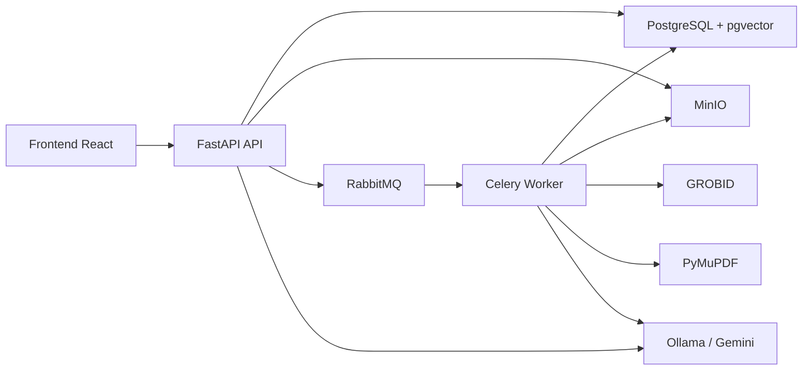
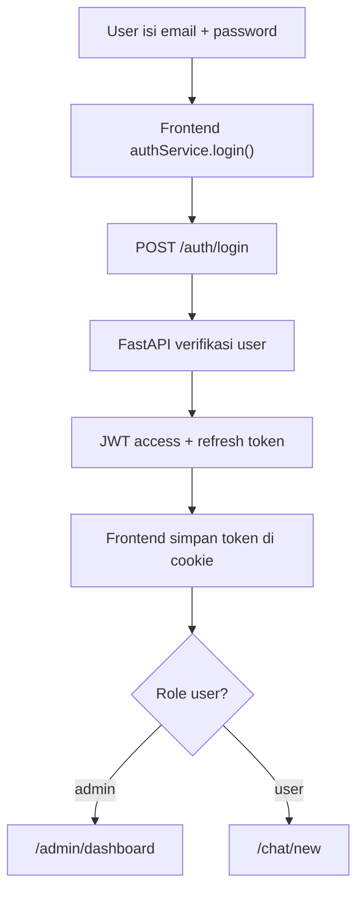
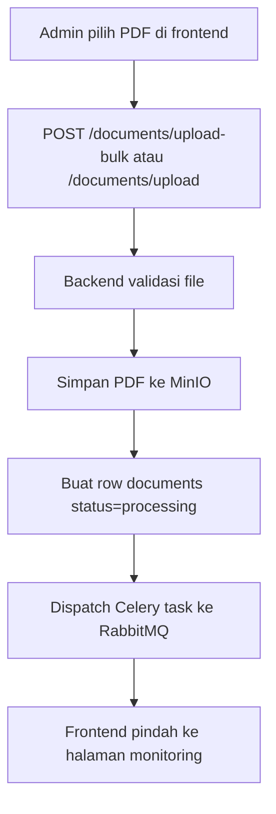
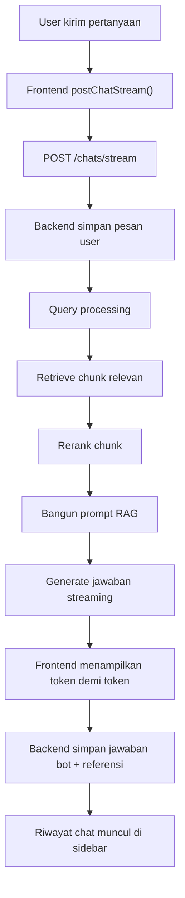
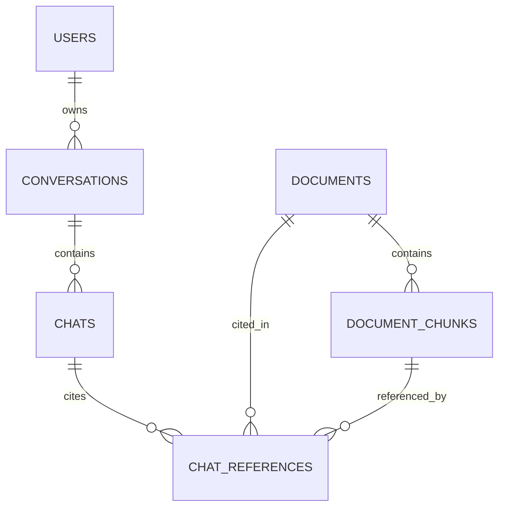

# Analisis Codebase SyntraFix

Codebase ini membuat website platform chatbot dokumen akademik berbasis RAG.

Secara fungsi, websitenya dipakai untuk:

- admin mengunggah file PDF seperti jurnal, thesis, report, atau buku
- sistem memproses isi dokumen menjadi metadata, potongan teks (chunks), dan embedding vector
- user bertanya lewat chat
- sistem mencari bagian dokumen yang paling relevan lalu membuat jawaban AI berdasarkan dokumen itu
- jawaban bot juga menyertakan referensi sumber dokumen/chunk yang dipakai

Jadi inti websitenya bukan website company profile biasa, melainkan aplikasi tanya-jawab dokumen ilmiah dengan dua sisi utama:

- panel admin untuk kelola dokumen dan memantau proses ingestion
- panel user/chat untuk berdialog dengan AI tentang isi dokumen

Dokumen ini menjelaskan keseluruhan codebase `SyntraFix` berdasarkan implementasi yang ada di repository saat ini. Fokus dokumen ini adalah:

- struktur sistem end-to-end
- teknologi yang digunakan
- alur pipeline website
- pipeline ingestion dokumen
- pipeline chat RAG
- rancangan database
- catatan penting dan inkonsistensi implementasi

Dokumen ini disusun dari pembacaan source code utama pada:

- `FastAPI/`
- `syntra-frontend/`
- `ragas/`
- `schema.sql`

Folder dependency dan build artifact seperti `venv/`, `node_modules/`, `dist/`, `.pytest_cache/`, dan file cache lain tidak diperlakukan sebagai source utama aplikasi.

---

## 1. Gambaran Umum Sistem

Secara arsitektural, repo ini berisi tiga subsistem utama:

1. `FastAPI/`
   Backend utama untuk authentication, manajemen dokumen, pipeline ingestion PDF, chat RAG, prompt-search experiment, dan integrasi penyimpanan.
2. `syntra-frontend/`
   Frontend React untuk landing page, login, dashboard admin, manajemen dokumen, monitoring proses, dan UI chat.
3. `ragas/`
   Workspace evaluasi kualitas RAG menggunakan RAGAS, terpisah dari backend produksi.

Secara fungsional, sistem ini adalah aplikasi tanya-jawab dokumen akademik. User atau admin mengunggah PDF, sistem mengekstrak metadata dan isi dokumen menjadi chunk ber-embedding, lalu user bisa bertanya ke chatbot yang menjawab berdasarkan dokumen tersebut.

Alur besar sistem:



Ringkasnya:

- frontend berbicara ke FastAPI lewat HTTP
- backend menyimpan metadata dan vector ke PostgreSQL
- file PDF disimpan di MinIO
- proses berat dijalankan async lewat Celery + RabbitMQ
- parsing dokumen memakai GROBID dan PyMuPDF
- retrieval dan generasi jawaban memakai embedding + LLM

---

## 2. Struktur Repository

Struktur tingkat atas:

```text
SyntraFix/
├── FastAPI/
├── ragas/
├── syntra-frontend/
└── schema.sql
```

### 2.1 Backend `FastAPI/`

Struktur penting:

```text
FastAPI/
├── app/
│   ├── api/routes/
│   ├── models/
│   ├── schemas/
│   ├── services/
│   ├── tasks/
│   ├── config.py
│   ├── database.py
│   ├── main.py
│   └── websockets.py
├── alembic/
├── requirements.txt
├── README.md
├── SYNTRA_PIPELINES.md
└── DOCUMENT_INGESTION_FLOW.md
```

Peran folder utama:

- `app/main.py`: entrypoint FastAPI
- `app/api/routes/`: definisi endpoint REST dan websocket
- `app/models/`: model SQLAlchemy
- `app/schemas/`: schema Pydantic untuk request/response
- `app/services/`: business logic inti
- `app/tasks/`: background jobs Celery
- `alembic/`: migrasi database

### 2.2 Frontend `syntra-frontend/`

Struktur penting:

```text
syntra-frontend/
├── src/
│   ├── App.tsx
│   ├── main.tsx
│   ├── components/
│   ├── lib/
│   ├── pages/
│   └── styles/
├── package.json
├── vite.config.ts
└── components.json
```

Peran folder utama:

- `src/App.tsx`: definisi routing aplikasi
- `src/lib/auth/`: auth client dan token handling
- `src/pages/auth/`: login dan register
- `src/pages/admin/`: dashboard, dokumen, user
- `src/pages/chat/`: halaman chat
- `src/components/`: reusable UI dan layout

### 2.3 Evaluasi `ragas/`

Folder ini dipakai untuk:

- menjalankan evaluasi kualitas jawaban RAG
- membaca sample data markdown
- menggabungkan hasil score ke CSV/XLSX
- eksperimen di luar runtime API utama

Folder ini bukan bagian runtime website, tetapi sangat relevan sebagai alat evaluasi kualitas retrieval dan generasi.

---

## 3. Teknologi yang Digunakan

## 3.1 Backend

Berdasarkan `FastAPI/requirements.txt` dan source code:

- `FastAPI`
  Framework API utama.
- `SQLAlchemy`
  ORM untuk model database dan query.
- `Alembic`
  Migrasi schema database.
- `PostgreSQL`
  Database relasional utama.
- `pgvector`
  Penyimpanan vector embedding di PostgreSQL.
- `python-jose`
  JWT access token dan refresh token.
- `bcrypt`
  Hash password.
- `MinIO`
  Object storage untuk file PDF dan aset biner.
- `Celery`
  Background task runner.
- `RabbitMQ`
  Message broker untuk Celery.
- `GROBID`
  Ekstraksi struktur dokumen akademik.
- `PyMuPDF`
  Ekstraksi text, tabel, gambar dari PDF.
- `Ollama`
  Serving model embedding dan generation.
- `google-generativeai`
  Alternatif/fallback untuk Gemini embedding dan generation.
- `RAGAS`
  Evaluasi kualitas RAG.

## 3.2 Frontend

Berdasarkan `syntra-frontend/package.json`:

- `React 19`
- `TypeScript`
- `Vite`
- `React Router`
- `@tanstack/react-query`
- `@tanstack/react-table`
- `Tailwind CSS v4`
- `shadcn/ui` ecosystem
- `Radix UI`
- `next-themes`
- `js-cookie`
- `dnd-kit`
- `recharts`
- `sonner`

Makna praktisnya:

- React untuk SPA
- React Router untuk route client-side
- React Query untuk fetching/cache API
- Tailwind + shadcn/ui untuk sistem UI
- js-cookie untuk menyimpan token auth
- React Table untuk tabel admin
- Recharts untuk dashboard chart

## 3.3 Infrastruktur dan Integrasi

Komponen infrastruktur yang diasumsikan aktif:

- PostgreSQL
- RabbitMQ
- MinIO
- GROBID
- Ollama

Konfigurasi berasal dari environment variable di `FastAPI/app/config.py`.

---

## 4. Konfigurasi dan Environment

File penting:

- `FastAPI/app/config.py`
- `FastAPI/.env`
- `syntra-frontend` memakai `VITE_API_BASE_URL`

Konfigurasi backend utama:

- `DATABASE_URL`
- `SECRET_KEY`
- `MINIO_ENDPOINT`
- `MINIO_ACCESS_KEY`
- `MINIO_SECRET_KEY`
- `MINIO_BUCKET`
- `MINIO_DOCUMENTS_BUCKET`
- `GROBID_URL`
- `CELERY_BROKER_URL`
- `OLLAMA_BASE_URL`
- `OLLAMA_EMBEDDING_MODEL`
- `OLLAMA_GENERATION_MODEL`
- `OLLAMA_EMBEDDING_DIMENSION`
- `GOOGLE_API_KEY` / `GEMINI_API_KEY`

Catatan penting:

- code aktif mengarah ke `OLLAMA_BASE_URL = http://localhost:11435`
- dimensi embedding aktif di config adalah `1024`
- model generation default adalah `llama3.1:8b-instruct-q8_0`
- model embedding default adalah `bge-m3:567m`

Implikasinya:

- schema vector database harus cocok dengan dimensi model embedding aktif
- worker dan API sama-sama bergantung pada environment yang konsisten

---

## 5. Arsitektur Backend

## 5.1 Entry Point

File: `FastAPI/app/main.py`

Peran utama:

- membuat instance FastAPI
- memasang CORS middleware
- mendaftarkan router
- menjalankan startup lifecycle

Saat startup:

- `Base.metadata.create_all(bind=engine)` dipanggil
- bucket MinIO dicek dan dibuat jika belum ada

Router yang aktif:

- `/auth`
- `/documents`
- `/chats`
- `/prompt-search`

Endpoint health:

- `GET /`
- `GET /health`

## 5.2 Lapisan Backend

Pola backend yang dipakai:

1. Route layer
   File di `app/api/routes/*`, menerima HTTP request.
2. Dependency layer
   Misalnya auth dependency di `app/api/deps.py`.
3. Service layer
   Business logic di `app/services/*`.
4. Persistence layer
   SQLAlchemy models + PostgreSQL.
5. Async worker layer
   Celery task di `app/tasks/document_tasks.py`.

Ini membuat tanggung jawab relatif terpisah:

- route fokus ke I/O HTTP
- service fokus ke proses bisnis
- task fokus ke pekerjaan background

---

## 6. Arsitektur Frontend

## 6.1 Entry Point

File: `syntra-frontend/src/main.tsx`

Tree provider:

- `QueryClientProvider`
- `ThemeProvider`
- `App`

Artinya frontend ini SPA React biasa dengan React Query global.

## 6.2 Routing

File: `syntra-frontend/src/App.tsx`

Route utama:

- `/login`
- `/register`
- `/unauthorized`
- `/`
- `/chat/new`
- `/chat/:id`
- `/admin/dashboard`
- `/admin/document`
- `/admin/document/create`
- `/admin/document/edit/:id`
- `/admin/document/process`
- `/admin/user`

Proteksi route:

- `ProtectedRoute`: semua user login
- `AdminRoute`: hanya role `admin`

## 6.3 Role-based UX

Login mengarahkan user:

- admin -> `/admin/dashboard`
- user -> `/chat/new`

Artinya sistem memang didesain untuk dua peran:

- admin: mengelola dokumen dan user
- user: memakai fitur chat

## 6.4 Sidebar dan Navigasi

File: `src/components/app-sidebar.tsx`

Sidebar memuat:

- dashboard admin
- document management
- user management
- chat baru
- riwayat chat

Riwayat chat diambil dari endpoint:

- `GET /chats/conversations`

---

## 7. Authentication Flow

## 7.1 Backend Auth

File penting:

- `app/api/routes/auth.py`
- `app/services/auth.py`
- `app/services/user.py`
- `app/api/deps.py`

Endpoint:

- `POST /auth/register`
- `POST /auth/login`
- `POST /auth/refresh`
- `GET /auth/me`

Flow login:

1. frontend kirim form-urlencoded ke `/auth/login`
2. backend verifikasi email + password
3. backend membuat access token dan refresh token
4. backend mengembalikan token + objek user

Flow refresh:

1. frontend kirim refresh token ke `/auth/refresh`
2. backend verifikasi token type `refresh`
3. backend membuat pasangan token baru

Dependency proteksi:

- `get_current_user()` membaca Bearer token
- `decode_token()` memvalidasi JWT
- user aktif di database harus ada

## 7.2 Frontend Auth

File: `src/lib/auth/authService.ts`

Perilaku utama:

- token disimpan di cookie `auth_token`
- token berisi:
  - `access_token`
  - `refresh_token`
  - `token_type`
  - `user`
- refresh otomatis dilakukan periodik setiap 5 menit
- refresh juga dijalankan saat tab fokus / visible

Kelebihan desain ini:

- session lebih nyaman untuk SPA
- state auth bisa direfresh tanpa relogin
- `useSyncExternalStore` dipakai untuk subscribe perubahan auth state

Catatan:

- token disimpan di cookie client-side biasa, bukan httpOnly cookie
- ini lebih sederhana untuk SPA, tetapi lebih lemah secara security dibanding httpOnly cookie

---

## 8. Pipeline Website Secara End-to-End

Ada dua pipeline utama website:

1. pipeline ingestion dokumen
2. pipeline chat RAG

Selain itu ada pipeline auth dan pipeline admin UI.

## 8.1 Pipeline User Login



## 8.2 Pipeline Upload Dokumen



## 8.3 Pipeline Monitoring Proses

Frontend admin page `process-document.tsx` melakukan polling:

- `GET /documents/processing-monitor`

setiap 3 detik.

Halaman ini menampilkan:

- total dokumen
- status processing/completed/failed
- progress persen
- progress possibly question

## 8.4 Pipeline Chat User



---

## 9. Pipeline Ingestion Dokumen

Pipeline ini adalah inti knowledge base building.

File utama:

- `app/api/routes/documents.py`
- `app/tasks/document_tasks.py`
- `app/services/document.py`
- `app/services/documents/*`
- `app/services/grobid.py`
- `app/services/embedding.py`
- `app/services/question_generator.py`
- `app/services/document_assets.py`

## 9.1 Langkah-Langkah Ingestion

1. Admin upload PDF.
2. Backend memvalidasi file.
3. File disimpan ke MinIO.
4. Record `documents` dibuat dengan status `processing`.
5. Task `process_document_task` dikirim ke Celery.
6. Worker mengunduh kembali PDF dari MinIO.
7. GROBID mengekstrak metadata, references, fulltext, structured sections.
8. PyMuPDF mengekstrak raw text, tabel, gambar, dan halaman.
9. Jika metadata kurang lengkap, LLM fallback dipakai.
10. Metadata dokumen disimpan ke tabel `documents`.
11. Smart chunking atau legacy chunking dijalankan.
12. Chunk tabel dan gambar dibuat sebagai teks.
13. Embedding content dibuat untuk tiap chunk.
14. Chunk disimpan ke tabel `document_chunks`.
15. Status dokumen menjadi `completed`.

## 9.2 Mengapa Async?

Ingestion sengaja dijalankan lewat Celery karena:

- parsing PDF mahal
- ekstraksi tabel/gambar mahal
- generation possibly question mahal
- embedding semua chunk mahal

Jadi request upload bisa cepat selesai sementara pekerjaan berat berjalan di background.

## 9.3 GROBID + PyMuPDF

Kedua alat dipakai bersamaan karena fungsinya saling melengkapi:

- GROBID:
  kuat untuk struktur akademik seperti title, abstract, authors, references, section
- PyMuPDF:
  kuat untuk teks mentah per halaman, image, table, dan hubungan layout

## 9.4 Chunking Strategy

Ada dua strategi:

- `SmartChunker`
  memanfaatkan hasil `structured_sections`
- `TextChunker`
  fallback berbasis ukuran chunk dan overlap

Smart chunking lebih baik karena:

- mempertahankan section dokumen
- menjaga konteks akademik
- memetakan page number lebih baik

Chunk menyimpan:

- content
- token_count
- embedding
- chunk_metadata
- page_number
- section_title
- chunk_type
- possibly_questions
- possibly_question_embedding

## 9.5 Tabel dan Gambar

Sistem tidak hanya menyimpan paragraf teks. Ia juga mencoba mengubah:

- tabel
- gambar

menjadi chunk teks yang bisa dicari, sehingga pertanyaan tentang figure, chart, atau table tetap punya peluang ditemukan saat retrieval.

## 9.6 Possibly Questions

Ini adalah fitur penting.

Setiap chunk bisa diberi daftar pertanyaan hipotetis yang kira-kira dapat dijawab oleh chunk tersebut. Tujuannya:

- memperbaiki recall retrieval
- membuat query user yang berbentuk natural question lebih mudah cocok

Ada dua embedding per chunk:

- content embedding
- possible-question embedding

Ini membuat retrieval bersifat hybrid, bukan satu jalur saja.

---

## 10. Pipeline Chat RAG

File utama:

- `app/api/routes/chats.py`
- `app/services/chat.py`
- `app/services/chat_query.py`
- `app/services/retrieval.py`
- `app/services/reranker.py`
- `app/services/rag_prompt.py`
- `app/services/llm.py`
- `app/services/embedding.py`

## 10.1 Flow Utama

1. User kirim pertanyaan.
2. Sistem ambil atau buat conversation.
3. Pesan user disimpan ke tabel `chats`.
4. Query dibersihkan dan dianalisis.
5. Entitas metadata diekstrak.
6. Query diperluas ke variasi bilingual.
7. Embedding query dibuat.
8. Kandidat chunk dicari dari dua jalur embedding.
9. Kandidat diberi hybrid score.
10. Kandidat direrank oleh LLM.
11. Chunk final dirangkai menjadi context.
12. Prompt RAG dibangun.
13. Model generation membuat jawaban.
14. Jawaban bot disimpan.
15. Referensi chunk yang dipakai disimpan ke `chat_references`.

## 10.2 Query Understanding

`ChatService` melakukan:

- cleaning query
- entity extraction
- keyword extraction
- metadata filtering

Entity yang didukung mencakup:

- tahun
- author/creator
- language
- publisher
- location
- source/journal
- DOI
- document type

Artinya retrieval bukan sekadar semantic vector search, tetapi juga mencoba memanfaatkan metadata relasional.

## 10.3 Query Expansion

Sistem meminta LLM membuat:

- variasi Bahasa Indonesia
- variasi English

Tujuannya tepat untuk domain paper akademik, karena user mungkin bertanya dalam Bahasa Indonesia sementara isi paper cenderung berbahasa Inggris.

## 10.4 Retrieval Hybrid

Sistem mengambil kandidat dari:

- `DocumentChunk.embedding`
- `DocumentChunk.possibly_question_embedding`

Kemudian menggabungkannya menjadi candidate pool.

Skor penting:

- `semantic_score`
- `question_score`
- `keyword_score`
- `hybrid_score`

## 10.5 Reranker

Setelah candidate pool terbentuk, sistem mengirim kandidat ke LLM reranker yang harus mengembalikan JSON ranking.

Jika JSON invalid atau reranker gagal:

- sistem fallback ke ranking hybrid biasa

Ini membuat sistem lebih robust.

## 10.6 Streaming Response

Endpoint `/chats/stream` mengembalikan NDJSON event:

- `start`
- `chunk`
- `done`
- `error`

Frontend menggunakannya untuk menampilkan jawaban token demi token.

---

## 11. Prompt Search Experiment

File:

- `app/api/routes/prompt_search.py`
- `app/services/prompt_search/*`

Fitur ini bukan jalur utama user, tetapi eksperimen internal untuk:

- mencoba beberapa variasi system prompt
- menjalankan retrieval + generation untuk tiap prompt
- mengevaluasi hasil dengan RAGAS
- memilih prompt terbaik

Ini menunjukkan codebase ini tidak hanya fokus membangun chatbot, tetapi juga menguji kualitas prompt secara sistematis.

---

## 12. Evaluasi RAG dengan Folder `ragas/`

Folder `ragas/` adalah workspace analisis terpisah.

Fungsinya:

- menjalankan evaluasi terhadap sample percakapan
- menyimpan hasil score CSV/XLSX
- memecah dataset markdown menjadi sampel
- menggabungkan hasil evaluasi

Metrik RAGAS yang disebut di README:

- faithfulness
- answer relevancy
- context precision
- context recall
- answer correctness

Nilai tambah folder ini:

- membantu validasi kualitas retrieval
- membantu membandingkan perubahan model/prompt/pipeline
- memisahkan eksperimen dari runtime produksi

---

## 13. Rancangan Database

Basis data yang terlihat dari source code dan `schema.sql` berpusat pada 5 entitas inti:

1. `users`
2. `conversations`
3. `chats`
4. `documents`
5. `document_chunks`
6. `chat_references`

## 13.1 ERD Konseptual



## 13.2 Tabel `users`

Tujuan:

- menyimpan akun pengguna
- menyimpan role admin/user
- mendukung autentikasi JWT

Kolom penting:

- `id`
- `email`
- `username`
- `password`
- `role`
- `is_active`
- `created_at`
- `updated_at`

Relasi:

- satu user punya banyak conversation

## 13.3 Tabel `conversations`

Tujuan:

- container untuk satu thread percakapan user

Kolom penting:

- `id`
- `user_id`
- `title`
- `is_pinned`
- `created_at`
- `updated_at`

Relasi:

- milik satu user
- punya banyak chat

## 13.4 Tabel `chats`

Tujuan:

- menyimpan semua message user dan bot

Kolom penting:

- `id`
- `conversation_id`
- `role`
- `message`
- `created_at`
- `updated_at`

Relasi:

- milik satu conversation
- satu chat bot bisa punya banyak reference

## 13.5 Tabel `documents`

Tujuan:

- menyimpan metadata dokumen akademik
- menyimpan status processing ingestion
- menyimpan lokasi file PDF di object storage

Kolom penting:

- `id`
- `title`
- `creator`
- `keywords`
- `description`
- `publisher`
- `contributor`
- `date`
- `type`
- `format`
- `identifier`
- `source`
- `language`
- `relation`
- `coverage`
- `rights`
- `doi`
- `abstract`
- `citation_count`
- `file_path`
- `is_private`
- `is_metadata_complete`
- `processing_status`
- `processing_progress`
- `processing_error`
- `created_at`
- `updated_at`

Catatan desain:

- metadata mengikuti pendekatan mirip Dublin Core
- tabel ini adalah pusat knowledge base metadata
- kolom processing memudahkan monitoring pipeline

## 13.6 Tabel `document_chunks`

Tujuan:

- menyimpan unit retrieval hasil chunking

Kolom penting:

- `id`
- `document_id`
- `chunk_index`
- `content`
- `token_count`
- `embedding`
- `possibly_questions`
- `possibly_question_embedding`
- `chunk_metadata`
- `page_number`
- `section_title`
- `chunk_type`
- `created_at`
- `updated_at`

Makna field penting:

- `embedding`
  vector utama untuk semantic search berbasis isi chunk
- `possibly_questions`
  daftar pertanyaan hipotetis untuk chunk
- `possibly_question_embedding`
  vector dari gabungan pertanyaan hipotetis
- `chunk_metadata`
  metadata fleksibel JSONB, misalnya source document, section, keywords, dan page mapping

Relasi:

- banyak chunk dimiliki satu dokumen

## 13.7 Tabel `chat_references`

Tujuan:

- menghubungkan jawaban bot ke dokumen/chunk yang dipakai

Kolom penting:

- `id`
- `chat_id`
- `document_id`
- `chunk_id`
- `relevance_score`
- `quote`
- `page_number`
- `created_at`
- `updated_at`

Nilai bisnis:

- penting untuk citation / source transparency
- memungkinkan frontend menampilkan sumber jawaban
- memudahkan audit jawaban RAG

---

## 14. Detail Skema Relasional

## 14.1 Foreign Key

Relasi foreign key yang terlihat di `schema.sql`:

- `conversations.user_id -> users.id`
- `chats.conversation_id -> conversations.id`
- `document_chunks.document_id -> documents.id`
- `chat_references.chat_id -> chats.id`
- `chat_references.document_id -> documents.id`
- `chat_references.chunk_id -> document_chunks.id`

## 14.2 Index Penting

Terlihat ada index pada:

- `users.email`
- `users.username`
- `documents.doi`
- `documents.title`
- `document_chunks.document_id`

Untuk retrieval vector, implementasi saat ini menyimpan vector di pgvector, tetapi `schema.sql` yang terbaca belum menunjukkan index ANN seperti `ivfflat` atau `hnsw`.

Implikasinya:

- semantic search tetap bisa jalan
- tetapi skalabilitas retrieval vector mungkin belum optimal untuk koleksi dokumen yang sangat besar

## 14.3 JSONB dan Vector

Desain tabel `document_chunks` cukup modern karena menggabungkan:

- data relasional biasa
- `JSONB` untuk metadata fleksibel
- `vector` untuk embedding

Ini cocok untuk use case RAG karena:

- metadata tetap bisa diquery dengan SQL
- retrieval semantic bisa dilakukan di database
- chunk tidak perlu dipindah ke vector DB terpisah

---

## 15. Integrasi Frontend ke Backend

## 15.1 Chat

Frontend file:

- `src/pages/chat/api.ts`

Endpoint backend yang dipakai:

- `POST /chats/`
- `POST /chats/stream`
- `GET /chats/conversations`
- `GET /chats/conversations/{id}`
- `GET /documents/{document_id}/download`

Frontend memetakan `role: bot` menjadi `assistant` agar konsisten dengan UI.

## 15.2 Dokumen

Frontend file:

- `src/pages/admin/document/api.ts`

Endpoint backend yang dipakai:

- `GET /documents/`
- `GET /documents/{id}`
- `POST /documents/upload-bulk`
- `GET /documents/processing-monitor`
- `POST /documents/{id}/possibly-questions/generate`

## 15.3 Auth

Frontend memakai:

- `POST /auth/login`
- `POST /auth/refresh`

Namun ada catatan khusus untuk register yang dijelaskan di bagian inkonsistensi.

---

## 16. Kualitas Desain dan Kekuatan Codebase

Hal-hal yang cukup kuat dari codebase ini:

- pemisahan backend/frontend/evaluasi cukup jelas
- ingestion pipeline asynchronous sudah tepat
- penggunaan MinIO + PostgreSQL + pgvector cocok untuk use case RAG
- chat retrieval tidak sederhana, sudah memakai:
  - metadata filter
  - bilingual query expansion
  - dual embedding path
  - reranker
- ada monitoring processing document
- ada evaluasi RAGAS dan prompt search experiment

Secara konsep, ini bukan chatbot dokumen yang dangkal. Ia sudah punya banyak komponen yang biasanya baru muncul di sistem RAG yang lebih matang.

---

## 17. Catatan Penting dan Inkonsistensi Implementasi

Bagian ini penting karena menjelaskan keadaan codebase apa adanya, bukan idealnya.

## 17.1 README Backend Sudah Tidak Sinkron

`FastAPI/README.md` masih menggambarkan project sebagai:

- post API
- MinIO image storage
- endpoint `/posts`

Padahal implementasi saat ini adalah:

- RAG Journal Chatbot API
- document ingestion
- chat RAG
- prompt search

Jadi README backend adalah artefak lama dan tidak merepresentasikan sistem aktif.

## 17.2 Register Page Frontend Belum Tersambung ke Backend Aktual

File:

- `syntra-frontend/src/pages/auth/register.tsx`

Masalah yang terlihat:

- register masih memakai action mock/simulated
- request diarahkan ke `/api/auth/register`, bukan ke `VITE_API_BASE_URL + /auth/register`
- field memakai `name`, sedangkan backend `UserCreate` kemungkinan mengharapkan `username`, `email`, `password`
- link bawah mengarah ke `/auth/login`, sementara route nyata adalah `/login`

Kesimpulan:

- login sudah terintegrasi
- register belum benar-benar integrated dengan backend saat ini

## 17.3 Skema Database dan Model Enum Tidak 100% Konsisten

Di `schema.sql`, enum tampak uppercase:

- `JOURNAL`, `CONFERENCE`, dst
- `BOT`, `USER`

Di model Python:

- `DocumentType` memakai lowercase string: `journal`, `conference`, dst
- `ChatRole` memakai lowercase: `bot`, `user`

Ini memberi indikasi ada evolusi schema/model yang pernah berubah. Bila database dibangun dari dump lama dan model berjalan dengan definisi enum baru, harus dipastikan migrasi final sudah sinkron.

## 17.4 Dimensi Embedding Berubah di Beberapa Tempat

Terlihat beberapa state historis:

- config aktif memakai `OLLAMA_EMBEDDING_DIMENSION = 1024`
- root `schema.sql` menunjukkan `vector(768)`
- migrasi lama juga pernah memakai `1536`, lalu `768`, lalu `1024`

Ini berarti project pernah berganti model embedding beberapa kali.

Implikasi penting:

- database yang sedang dipakai harus cocok dengan config aktif
- jika tidak, insert atau query vector bisa gagal

## 17.5 Migrasi Chat Table Kosong

File:

- `alembic/versions/934e4372c360_create_chat_tables.py`

`upgrade()` dan `downgrade()` kosong.

Ini memberi sinyal bahwa:

- chat schema mungkin dibuat dari migrasi lain / dump manual
- histori migrasi tidak sepenuhnya rapi

## 17.6 Base.metadata.create_all Dipakai Bersamaan dengan Alembic

Di `app/main.py`, startup memanggil:

- `Base.metadata.create_all(bind=engine)`

Padahal repo juga memakai Alembic.

Ini bukan selalu salah, tetapi berpotensi menimbulkan:

- schema drift
- pembuatan tabel diam-diam di luar migrasi formal

Untuk project yang makin besar, biasanya dipilih salah satu pola utama:

- full Alembic migration driven
- atau create_all untuk tahap sangat awal development

## 17.7 CORS Masih Terbuka Penuh

Di backend:

- `allow_origins=["*"]`

Ini nyaman untuk development, tetapi terlalu longgar untuk production.

---

## 18. Saran Pembacaan Codebase Berdasarkan Tujuan

Jika ingin memahami codebase ini lebih cepat, urutan bacanya sebaiknya:

### Untuk memahami arsitektur umum

1. `FastAPI/app/main.py`
2. `syntra-frontend/src/App.tsx`
3. `FastAPI/app/config.py`
4. `schema.sql`

### Untuk memahami ingestion dokumen

1. `FastAPI/app/api/routes/documents.py`
2. `FastAPI/app/tasks/document_tasks.py`
3. `FastAPI/app/services/grobid.py`
4. `FastAPI/app/services/documents/chunking.py`
5. `FastAPI/app/services/documents/extraction.py`

### Untuk memahami chat RAG

1. `FastAPI/app/api/routes/chats.py`
2. `FastAPI/app/services/chat.py`
3. `FastAPI/app/services/retrieval.py`
4. `FastAPI/app/services/reranker.py`
5. `FastAPI/app/services/llm.py`
6. `FastAPI/app/services/embedding.py`

### Untuk memahami frontend

1. `syntra-frontend/src/App.tsx`
2. `syntra-frontend/src/lib/auth/authService.ts`
3. `syntra-frontend/src/pages/chat/*`
4. `syntra-frontend/src/pages/admin/document/*`

---

## 19. Ringkasan Akhir

`SyntraFix` adalah codebase aplikasi RAG dokumen akademik berbasis web dengan arsitektur tiga bagian:

- backend FastAPI
- frontend React/Vite
- workspace evaluasi RAGAS

Teknologi utamanya:

- FastAPI
- React + TypeScript + Vite
- PostgreSQL + pgvector
- MinIO
- Celery + RabbitMQ
- GROBID
- PyMuPDF
- Ollama / Gemini

Pipeline paling penting:

1. Admin upload PDF
2. PDF diproses async menjadi metadata + chunk + embedding
3. User bertanya lewat chat
4. Sistem melakukan hybrid retrieval + reranking
5. LLM menjawab berdasarkan konteks dokumen
6. Referensi jawaban disimpan dan bisa ditampilkan

Rancangan database berpusat pada:

- user
- conversation/chat
- document
- document_chunk
- chat_reference

Secara keseluruhan, codebase ini sudah memiliki fondasi yang cukup kuat untuk sistem RAG yang serius, terutama pada sisi ingestion pipeline dan retrieval strategy. Bagian yang paling perlu dibereskan jika ingin lebih production-ready adalah sinkronisasi dokumentasi, konsistensi migrasi/schema, dan penyelarasan penuh frontend register dengan backend auth aktual.
